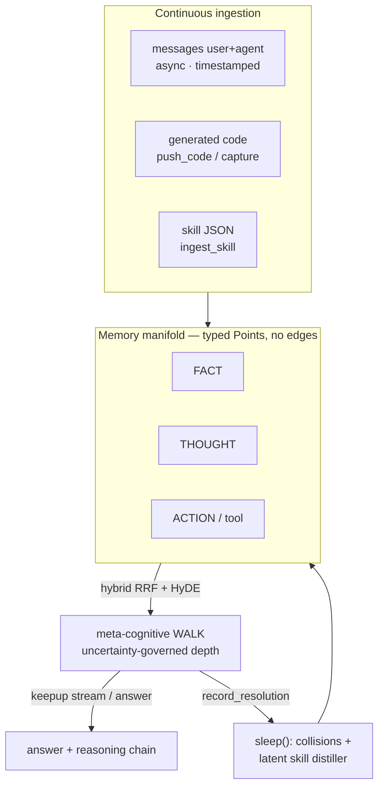
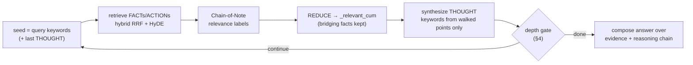
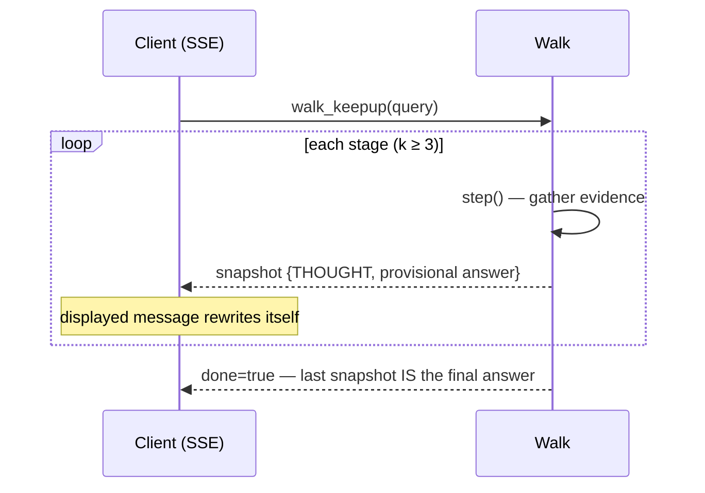
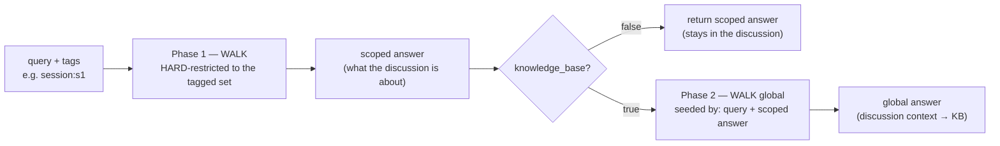
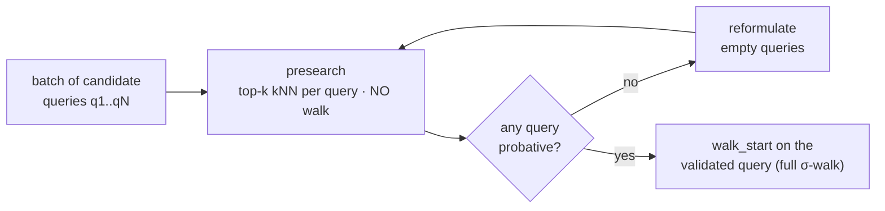
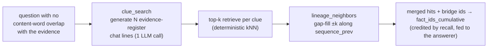
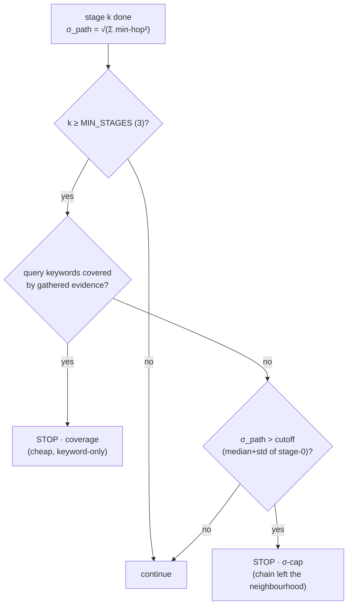
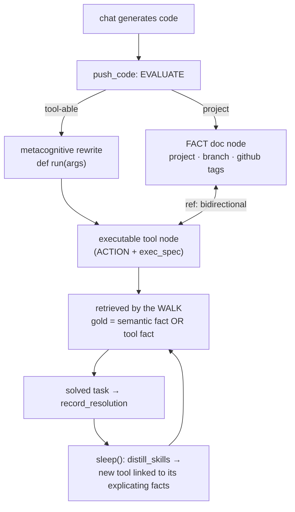

# OmniCognition / MetaCog-Mem

### A Hyperparameter-Free Metacognitive Memory Manifold for LLM Agents

*Epistemically-typed points, edge-free geometric relations, and a
retrieval walk whose depth is governed by the propagation of uncertainty.*

---

## Abstract

We present **MetaCog-Mem**, a memory architecture for large-language-model
agents built on three commitments: (i) memory is a **manifold of
epistemically-typed points** — facts, thoughts, actions, and self-built
tools sharing one schema and one lifecycle — rather than a graph of
materialized edges; (ii) every threshold is either a mathematical constant
or **emerges from the data** (no tunable hyperparameters); and (iii) the
provenance of every datum is **typed and audited**, so generated content
can become *content* but never *evidence* (anti-laundering by
construction). Retrieval is a coordinated **walk** over the three point
kinds at once. Its central novelty is that **walk depth is governed by the
propagation of uncertainty** (GUM 1995) over the retrieved evidence chain:
a hard floor of three hops, an emergent σ-cap derived from the manifold's
own local resolution, and a deterministic keyword-coverage stop — no
fixed maximum and no learned controller. A single invocation runs the
walk to completion; an agent above it performs only *breadth pivots* —
optionally **scoped** to a discussion before escalating to the global
knowledge base, **gated** by a cheap batch pre-search so a non-probative
query never pays for a full walk, and **targeted** by tri-modal
(exact / fuzzy / regex) matching over the hierarchical tag namespace. On
the LoCoMo long-conversation benchmark the walk raises evidence
**agent-recall from a static 0.31 (Recall@7) to ≈ 0.85**, while a
keyword-oriented token-discipline pass cuts the worst-case per-query input
cost by **84 %** (118k → 19k tokens). Relative temporal expressions are
resolved to absolute dates deterministically at both ingestion and answer
time. The system is implemented as a Python library and an MCP service;
all claims are reproducible from the included LoCoMo harness.

---

<details>
<summary><b>📖 Details — full documentation</b> &nbsp;(click to expand)</summary>

## 1. Introduction

LLM agents that converse over long horizons need a memory that (a)
*retrieves* the evidence bearing on a question even when the question and
the evidence share no surface vocabulary, (b) *reasons* across several
hops without losing the thread, (c) *consolidates* redundancy on its own,
and (d) never silently promotes its own guesses to facts. Graph-of-edges
memories satisfy (a)–(c) at the price of materialized relations and a
thicket of tuning knobs; they rarely address (d).

MetaCog-Mem takes the opposite stance on each axis. Relations are not
stored — they are the **geometric pull** between points in a
keyword-embedding manifold (§2). The retrieval walk is not bounded by a
hand-set depth — it is bounded by the **accumulated uncertainty of its own
evidence chain** (§4). Consolidation is not scheduled — it fires from a
single **Poisson floor** that is parameter-free (§5). And provenance is
not advisory — a generated `Observation` raises a `LaunderingError` at the
type level (§2.3).

The remainder of this document specifies each component and reports the
LoCoMo evaluation. Module-level documentation lives in
[`metacog/README.md`](metacog/README.md); the benchmark harness and the
full per-version results table live in
[`benchmarks/locomo/README.md`](benchmarks/locomo/README.md).

### 1.1 Architecture at a glance



The manifold holds one kind of object — a typed `Point`. Everything else
is a process over it: ingestion feeds it, the walk reads it, sleep
consolidates it. There are no edges; relations are geometric proximity.

### 1.2 The three tool tiers

The tools that operate the memory are classified by role
(`metacog/canonical_tools.py`, test-guarded to partition the live tool set
exactly). This separates *what the memory needs to run* from *what an external
agent should see*, and is the axis along which the MCP surface is gated
(`METACOG_SURFACE` / `build_app(surface=…)`):

- **T1 — canonical primitives** *(exposed).* The minimum to run the memory:
  **feed** (`ingest`, `ingest_message`, `push_code`), **ask** (`retrieve`,
  `walk_start`, `assemble_set`, `relate`), **observe** (`stats`, `inspect`,
  `list_tags`), **feedback/correct** (`mark_useful`, `forget`).
- **T2 — agent-tool machinery** *(exposed).* How the agent creates, finds,
  reuses, and retires its **own** tools (`ensure_tool`, `match_tool`,
  `build_skill`, `list_tools_learned`, `report_tool`, `retire_tool`,
  `update_tool`).
- **T3 — internal** *(callable, not on the external surface).* The specialized
  retrieval modes the walk orchestrates (`presearch`, `scoped_*`, `clue_search`,
  `event_search`, `reason`, `walk_keepup`), the bag mechanism, observators, and
  the **autonomic** passes (`sleep`, `save`, `audit`, `crystallize_skills`).

The `external` surface = T1 + T2; T3 stays callable internally so the walk /
sleep orchestrate it without cluttering the agent's toolset.

### 1.3 Emergent (self-built) tools

Agent tools are **not** a fixed list of `@app.tool()`s — they **grow as data**.
When the agent recognises a capability it lacks, `ensure_tool` generates it *and
stores it as a `tool`-tagged ACTION node inside the manifold*, scoped by the
keywords of the need. Two creation triggers:

1. **On demand** — "no covering tool → make it" (`ensure_tool`); the next time a
   query falls in its keyword scope, `match_tool` returns it and the think phase
   is skipped (reuse, no LLM).
2. **By recurrence** — `crystallize_skills` (in `sleep`) folds an action
   re-derived across *diverse* queries into a persistent tool node (same Poisson
   floor `λ+√λ` as every other emergence law).

Because a tool **is a Point**, the canonical agent **retrieves the tools it
created like any other node** — no separate registry. And the set is not
append-only: `report_tool` reinforces or auto-retires by outcome, `retire_tool`
soft-deprecates (so `match_tool` stops reusing it), `update_tool` rewrites and
revives. Growth **and** decay, on tools as on facts.

The moment an emergent tool is created it is **auto-registered as a wiki
concept** (an OKF `type: tool` doc referencing the tool node, §5.6) — so the
self-built capability set is also a browsable, queryable part of the deepwiki.

---

## 2. The epistemic substrate

### 2.1 Typed points share one database

A memory is a set of `Point`s (`metacog/epistemic.py`). Every point —
whether a `FACT`, a `THOUGHT`, an `ACTION`, or a self-built tool — carries
the same schema: an original embedding, a position-weighted **keyword
embedding** (the projection of the point onto an entity manifold), a Beta
posterior over corroboration/contradiction counters, an open **tag**
vocabulary (`tool`, `tool_workflow`, `entity`, `atomic`,
`lateral_absorbed`, …) that refines the point's role over time, and a
lineage. One schema, one assimilation function `A(·)`, one state machine.

### 2.2 Manifold over graph

There are no materialized edges. The relation between two points *is* their
proximity under the current **effective embedding** — a Reciprocal-Rank
fusion of semantic cosine, position-weighted keyword cosine, BM25 on raw
content, and fuzzy Levenshtein (`metacog/geometry.py`,
`metacog/bm25.py`, `metacog/fuzzy.py`). Two points are "linked" exactly
when `apply_pull` has drawn them together; the pull's step size
`1/(1+n_obs)` is itself parameter-free. Edge-free entity *beacons*
(`metacog/entities.py`) reproduce the effect of an extraction edge purely
by co-location.

### 2.3 Anti-laundering by construction

Following Romanchuk & Bondar's *Semantic Laundering*
(arXiv:2601.08333), provenance is a **type**. Observations carry a
`SourceClass`; constructing an `Observation(source=GENERATOR)` raises
`LaunderingError`. LLM output may enter the manifold as *content* (∈ P)
— a generated `THOUGHT` or `ACTION` — but it can never enter the
observation set O that updates a point's epistemic counters. The
`metacog/audit.py` pass verifies the invariant holds over a whole store
(Corollary 5).

### 2.4 No hyperparameters, append-only forgetting

Every "threshold" is a mathematical constant (`cos π/4`, `cos π/12`) or
emerges from the population (`median ± σ` for collision; the Poisson floor
`λ + √λ` for every recurrence law). Forgetting is **append-only, never a hard
delete**: an invalidated point keeps its row but its state `INVALID`/`DEPRECATED`
**exiles** it geometrically and drops it from retrieval and the walk, while new
corroborating observations resurrect it automatically. Both an autonomic
decay-driven pass and an explicit agent `forget` use this same soft mechanism
(§5.3) — the store only ever grows; visibility is what changes.

---

## 3. The meta-cognitive walk

Retrieval is a coordinated traversal over the three kinds at once
(`metacog/meta_walk.py`). Each stage:

1. **retrieves** the nearest FACTs and ACTIONs to the current seed (hybrid
   RRF), with an additive **HyDE** channel (Gao et al. 2022) that
   generates three hypothetical evidence lines and RRF-merges their
   retrieval — closing the vocabulary gap on abstract "inference"
   questions;
2. **reads** each retrieved fact with a **Chain-of-Note** relevance pass
   (Yu et al. 2024), folding the on-target subset into a persistent
   MAP-REDUCE accumulator that no later stage can discard;
3. **synthesizes** a `THOUGHT` whose keywords are drawn *only* from the
   walked points' preexisting keywords (never invented), extending a
   reduce-folded reasoning chain that seeds the next stage.

A single `walk_start` runs the walk to **completion** (§4); the agent
above it performs only **breadth pivots** — re-issuing `walk_start` with
different vocabulary when a thread is exhausted — never stage-by-stage
micro-driving. This alignment of the two control loops is what lets the
uncertainty-governed depth actually run at inference time.



### 3.1 Keepup — organic streaming

Because the depth-gate (§4) already evaluates sufficiency at every stage,
the system can answer **organically** instead of waiting for a final pass.
In **keepup** mode (`Memory.answer_keepup`, MCP `walk_keepup`) a
*provisional* answer is synthesised from the very first walk and
**re-written every stage** as evidence accumulates; the live `THOUGHT` is
streamed alongside it. The walk runs once, continuously — so the moment
the σ / coverage gate validates (`done`), the provisional answer is
*already* the final one: there is no separate final-generation latency. If
the answer was correct at stage 4 and stage 5 only confirms it, the user
saw the right answer a stage early. Generation is therefore continuous and
asynchronous; over the SSE transport (§7.2) the client renders a single
message that rewrites itself until validated.



### 3.2 Scoped retrieval — discussion first, then the knowledge base

Tag-filtered retrieval is a **two-phase cascade**
(`Memory.scoped_answer(query, tags, knowledge_base=…)`, MCP
`scoped_answer`). **Phase 1** runs a full uncertainty-governed walk
**hard-restricted** (`MetaWalker(restrict_ids=…)`) to the points carrying
*all* the given tags — e.g. `["session:s1"]`, a single discussion — to
establish *what is being talked about there*. **Phase 2** then, only when
`knowledge_base=True`, seeds a **second** walk over the *whole* memory with
the original query enriched by Phase-1's finding, so the discussion context
drives the global search. With `knowledge_base=False` the answer stays
strictly inside the filtered set. This is the difference between the soft
`section_filter` (an in-walk RRF rank boost, §5) and a hard scope: scoped
retrieval *first* resolves the reference inside the discussion, *then*
optionally reaches the global knowledge base seeded by what it found.

**Tag matching is tri-modal** (`match=exact|fuzzy|regex`, resolved by
`metacog/tags.py`). Tags are hierarchical on `:` — `ref:date:2022`,
`session:s1`, `ref:skill:plot:path:…`. `exact` matches equality **or
hierarchical ancestry**, so filtering on the namespace `ref:date` selects
every `ref:date:2022`/`…:2023` point; `fuzzy` tolerates typos
(segment-wise Levenshtein, reusing the §-fuzzy edit budget); `regex` runs
`re.search` on the raw tags (e.g. `^ref:date:202[0-9]$`). The available
namespaces are discoverable via **`list_tags`**, which returns the
glossary of **parent prefixes** of every hierarchical tag (the leaf —
the concrete value — is dropped), ordered by hierarchy depth.



### 3.3 Pre-search gate — validate a query before spending a walk

A single `walk_start` runs the *whole* σ-governed walk **and** (under
`scoped_answer`) the knowledge-base escalation. A query that has no
probative evidence at its seed therefore pays that entire cascade for
nothing. The **`presearch`** tool is the cheap gate in front of it: given
a **batch of candidate queries**, it returns the top-`k` (default 3)
nearest hits **per query** by plain kNN — **no walk, no escalation**. The
agent reads the hits, decides which queries are probative, reformulates
the empty ones, and only then calls `walk_start` on a validated query. An
optional `tags` pre-filter (same `exact|fuzzy|regex` semantics) orients
the gate to a date / session / namespace, so reconnaissance can itself be
scoped before any walk is paid for.



### 3.4 Evidence-register expansion — when the answer's words are not in the question

A subset of inference questions (`cat3` on LoCoMo — *"what might X's
financial status be?"*) shares **no content words** with their gold
evidence: the evidence is a casual aside in a different register
(*"my kids have so much and others don't"* ⇒ *wealthy*), and a literal
retrieval cannot reach it. HyDE on a hypothetical answer (*"X is
wealthy"*) also misses — that stays in the answer's register
(*money / wealth*), not the evidence's.

**`clue_search(question)`** inverts HyDE. A single LLM call brainstorms
*N* concrete first-person chat lines, each one a hypothetical **piece of
evidence for a DIFFERENT plausible answer** — spanning the answer space
(*well-off ↔ struggling*, *direct purchase ↔ indirect family aside*) in
the register a person actually types. Each clue then drives a small
top-k retrieval. The clues whose words match real turns surface the
casual asides that exist in the conversation, and the agent infers the
answer from what stuck.

**`lineage_neighbors`** — the deterministic lineage bridge — closes the
last gap. Clue retrieval typically lands on the **neighbours** of the
gold turn (its previous/next utterances along `sequence_prev`), but not
on the gold itself. For every conversation chain the clues touched, the
bridge **gap-fills the contiguous turns between the lowest and highest
position** the chain saw (bounded so a sparse far-apart pair does not
drag a whole session in), plus ±k turns of edge expansion. No LLM,
deterministic. The same routine is reused by `walk_start` as
`neighbor_possibilities()` to bridge a walk that retrieved only the ends
of a stretch.



A worked example of the full cascade on the hardest cat3 instance
(`What might John's financial status be?`) is in
[§6.1](#61-worked-example--johns-financial-status) and in
[`docs/john_walkthrough.md`](docs/john_walkthrough.md).

### 3.5 Query-alignment anchor — drift resistance

Every signal that drives the walk and `clue_search` is RELATIVE — a fact is
scored against the latest reflection, the σ-neighbourhood, or a brainstormed
clue. That relativity lets the walk go deep, but it also lets it DRIFT off
the original question (classic pseudo-relevance-feedback *query drift*): a
noisy clue ("books on gardening") or a co-present topic (Caroline's
counselling persona on a "what did she research?" question about adoption)
hijacks the ranking. The literature's answer is an explicit ANCHOR to the
original query, kept **additively** (Rocchio's α·q_original term; ReformIR's
"always score relevance w.r.t. the original query"; multi-hop RAG's
fixed-fraction-per-hop blend). `metacog/query_anchor.py` implements it as a
typed, parameter-free alignment in three composable slices:

- **(A) the primitive.** `build_query_anchor(question)` extracts SALIENT
  terms (named entities + content keywords — high-IDF, **exact-match
  preferred** à la ColBERT) and SOFT terms (implied topics — semantic), and
  encodes the input ONCE into a fixed anchor vector. `alignment_score(anchor,
  fact)` is then O(1): an IDF-weighted exact-stem match on the salient terms
  (the ubiquitous speaker name is IDF-driven to ~0) plus a single cosine of
  the once-encoded input against the fact's already-stored embedding. No
  per-token, per-stage re-encoding.
- **(B) `clue_search` re-rank (Rocchio / ReformIR).** The merged clue hits
  are re-ranked `(1−α)·clue_relative + α·alignment`, so the on-question turn
  rises and off-question noise sinks without discarding the clue signal.
- **(C) per-stage walk anchor (multi-hop).** The typed alignment is a fourth
  RRF channel in every walk stage (lexical-only there — exact-match is the
  drift-resistant signal, and it costs no encoding), so a walk seeded with
  the wrong vocabulary ("research project study") still pulls the gold
  ("Researching adoption agencies") into its relevant set.

All three are ADDITIVE — the relative per-stage signal is never replaced.

**The alignment score, concretely.** For a fact *f* with stored embedding
`e_f` and an anchor built from the question *q*,

```
   alignment(anchor, f)  =  w_lex · LEX(anchor, f)  +  w_sem · max(0, cos(e_q, e_f))

   LEX(anchor, f)  =  ( Σ_{t ∈ salient∪soft}  w_t · idf(t) · 1[ stem(t) ⊆ stems(f) ] )
                      / ( Σ_t  w_t · idf(t) )

   idf(t)  =  log(N / df(t)) / log(N)            # ∈ (0,1], parameter-free
```

`e_q` is the input **encoded once** (not synthesised from the extracted
terms); `e_f` already exists from ingestion — so scoring a fact is **one
cosine + a set-membership test**, not a per-token re-encoding (an earlier
ColBERT-faithful MaxSim re-encoded every turn token at every stage and the
walk crawled). The IDF weight is the crux: the conversation's ubiquitous
speaker name ("caroline", in every turn via the `Speaker:` prefix) is driven
to ~0, while the question's rare verb/objects ("research", "adoption")
dominate — ColBERT's high-IDF exact-match preference, made parameter-free.
The caller blends `(1−α)·relative + α·alignment` with **α = 0.5** (Rocchio /
PRF: keep the original-query weight high or feedback drifts the ranking).

**One lesson worth recording.** Slice C (the walk channel) uses the
**lexical part only** — adding the `cos(e_q, e_f)` term there *re-introduced*
the dominant-topic bias (`cos(question, fact)` favours the co-present topic),
diluting the gold's exact-match lead and dropping it back out of the relevant
set. The semantic cosine belongs in `clue_search` (Slice B), where it is a
soft re-rank; in the walk, the precise IDF exact-match is what resists drift.

---

## 4. Uncertainty-governed depth

The walk's defining property is that **its depth is the propagation of
uncertainty over the evidence chain**, in the sense of the *Guide to the
Expression of Uncertainty in Measurement* (BIPM, GUM 1995;
`metacog/uncertainty.py`). Let `fact★_k` be the fact the walk commits to
at stage *k*. We accumulate

```
        σ_path  =  √( Σ_k  σ_hop,k² )
```

where, crucially, `σ_hop,k` is **not** the volatility of the fact choice
but a measure of **chain coherence**:

```
        σ_hop,k  =  min_{f ∈ retrieved_k}  ( 1 − cos(fact★_{k−1}, f) )
```

— the smallest keyword-embedding distance from where the chain last stood
to anything reachable this stage. Three structural rules, no tuning knobs,
govern termination:

- **Floor.** The first `_MIN_STAGES = 3` hops always run.
- **σ-cap.** Once `σ_path` exceeds the walk-local emergent threshold —
  the median + std of the stage-0 facts' pairwise distances, i.e. the
  manifold's *own* local resolution — the evidence chain has wandered out
  of the coherent neighbourhood and the walk stops. A coherent gold trail
  keeps consecutive hops small, so σ grows slowly and the walk goes deep
  on its own; wandering adds a large hop and trips the cap fast.
  **Gold-retrieval extension is therefore intrinsic to σ**, requiring no
  separate relevance gate. (An earlier Chain-of-Note gold-gate was
  removed: its signal was stochastic and bimodal — one run labelled every
  turn relevant and the walk ran 16 stages collecting 80 facts, the next
  labelled none and the walk was strangled at the floor.)
- **Keyword-coverage stop.** A deterministic, LLM-free metacognitive
  check: once the gathered evidence's keywords cover every query keyword,
  the walk holds turns bearing on each facet of the question and stops.
  Vocabulary-gap questions never reach full coverage, so σ governs those —
  they are never cut short.

Put as a single termination predicate, the walk halts at stage *k* iff

```
   k ≥ _MIN_STAGES   AND   ( σ_path(k) > cutoff   OR   covers(query, evidence) )
```

with `cutoff = median(d₀) + std(d₀)` over the stage-0 pairwise distances.
**Uncertainty is the primary stop**: the walk continues precisely as long
as its evidence chain stays inside the manifold's own resolution, and
terminates the moment the accumulated σ says the chain can no longer be
trusted — no fixed maximum, no learned controller, no caller override
(§7.2). The floor guarantees a minimum exploration; coverage is an early
exit for questions whose vocabulary the evidence already spans.



A coherent gold trail keeps the per-stage min-hop small, so σ grows slowly
and the walk goes deep; wandering adds a large hop and σ trips fast.

**Why this matters empirically.** A naive depth measure — the
stage-to-stage drift of the re-anchored seed — is ≈ 0 (the seed is
re-anchored on the query each hop) and never trips; a fact★-to-fact★ drift
is roughly constant (~0.25/hop, the volatility of *choosing* the
least-uncertain fact) and trips uniformly at 4–5 stages with no adaptive
range. The coherence signal above is the one that produces *adaptive*
depth: easy queries cap early via coverage, vocabulary-gap inference
queries dig as long as the trail stays coherent.

### 4.1 Token discipline

Depth without bound is expensive. Two keyword-oriented, deterministic
caps hold the cost down without touching recall:

- `walk_start` returns at most `_MAX_RETURNED_FACTS = 20` retrieved turns
  (a deep walk can surface 100 +; shipping all their content to the agent
  was the dominant input-token sink).
- The composable evidence handed to synthesis is capped to
  `_MAX_EVIDENCE = 15`, ranked by relevance label then **chain-vocabulary**
  overlap (so vocabulary-distant gold the walk bridged to is kept, not the
  raw query terms).

Full recall is preserved in `fact_ids_cumulative`; only what is *composed
over* is bounded. On the worst observed case these caps cut per-query
input from **118k to 19k tokens (−84 %)** with an unchanged answer.

### 4.2 Deterministic temporal resolution

Temporal questions need the **absolute** dates the gold answers use, but
conversation turns speak in **relative** terms ("last year", "yesterday",
"3 years ago"). MetaCog-Mem resolves this in **two deterministic stages**,
no LLM in the resolution path:

**Stage 1 — at ingestion** (`benchmarks/locomo/eval.py`,
`_expand_relative_dates`). Each turn carries its session date as a content
prefix (`[8 May 2023] Melanie: …`). Every relative expression in the turn
is computed against that anchor and the turn is augmented with **two**
forms — a typed token for retrieval and a plain clause for generation:

| expression (turn) | session date | appended to content |
|---|---|---|
| "… last year" | 8 May 2023 | `[ref:date:year:2022] (absolute date: 2022)` |
| "yesterday …" | 17 March 2022 | `[ref:date:day:16 ref:date:month:march ref:date:year:2022] (absolute date: 16 March 2022)` |
| "for 3 years" | 27 March 2023 | `[ref:date:year:~2020] (absolute date: around 2020)` |
| "last month" | 10 June 2023 | `[ref:date:month:may ref:date:year:2023] (absolute date: May 2023)` |

The `ref:date:*` compounds are *typed* tokens (so the keyword extractor and
BM25 match `month:march`, not a bare `march` diluted by every dated
prefix); the `(absolute date: …)` clause is what the generator reads. The
original wording is never altered — the expansion is additive.

**Stage 2 — at answer time** (`benchmarks/locomo/mcp_meta_agent.py`,
`_resolve_relative_date_answer`). If the generated answer still *is* or
*contains* a relative phrase, a post-processor finds the evidence turn that
carries the **same** phrase plus an `(absolute date: X)` clause and
rewrites the answer to `X` (falling back to the unique absolute date seen
if the phrase match is ambiguous). This closes the temporal **0-clue**
case — *"When did Melanie paint a sunrise?"* where the gold turn is an
image with no retrievable text: the walk answers from the dated neighbour,
the generator echoes "last year", and Stage 2 rewrites it to **"2022"**
(token-F1 = 1.0). Both stages are pure string/arithmetic operations and
deterministic across runs.

---

## 5. Self-organizing consolidation — one law, four mechanisms

A single Poisson floor (`λ + √λ`, no hyperparameter) drives four
self-organizing forms of *deduplication*, each opt-in and (where it
removes nothing) non-destructive:

| mechanism | recurrence of… | → dedup of… | module |
|---|---|---|---|
| **Proximity / identity collision** | points that sit too close / restate each other | redundant **nodes** (fission or merge) | `collision.py` |
| **Lateral collision** | facts co-retrieved under *diverse* queries | wasted **kNN slots** (one keeper, members expanded on-target) | `lateral.py` |
| **Spike–Chasles (reasoning)** | reasoning hops repeated along a path | **path length** (A→B→C→D ⇒ A→M→D) | `spike.py` |
| **Spike–Chasles (workflows)** | action steps repeated across walks | **workflow step-count** (⇒ one `tool_workflow` node) | `spike.py` |
| **Memory skills / tools** | actions re-derived for diverse queries | redundant **capability** (one persistent tool node) | `skills.py` |

Two shared notes: every law weights recurrence by **query diversity** (an
event that repeats a seen direction adds ≈ 0; only distant directions
accumulate), and each is **gated** so it stays inert on small clouds where
"redundant" is undefined.

### 5.1 Memory skills — self-built (automated) tools

A capability the system keeps re-deriving crystallizes into a **tool**: a
*normal node* (kind `ACTION`, tagged `tool` + a genre tag
`tool_code`/`tool_command`/`tool_api` + grounding-context tags), scoped by
its keywords. Being a normal node it lives in the same cloud — persisted on
save, found by the walk **recursively**, and subject to lateral collision
and Chasles compression like anything else. The tool set is therefore
self-built, self-pruning, and self-retrieving; nothing about it is a
special case.

Three mechanisms govern automation (`skills.py`):

- **Two triggers.**
  *Recurrence* (`crystallize_skills`) — an action re-derived across enough
  **diverse** queries (the same Poisson floor `λ + √λ`, diversity-weighted)
  earns a persistent tool over time.
  *Eager* (`ensure_tool`) — the "no tool → generate it → proceed" step:
  on first need, with no recurrence wait. Generation is unconstrained, so
  it never blocks; it only ever *grows* the self-built set.
- **Tool-intent metacognition** (`assess_tool_intent`) — reads a `THOUGHT`
  or a generated response and judges whether it implies running code or a
  command underneath, i.e. whether there is a tool to generate at all.
- **Fast-path reuse** (`match_tool`) — an in-scope query returns its
  covering tool via keyword-cosine (threshold `cos`-based, not tuned), so
  the agent reuses the cached capability and **skips a think phase**.

```python
m.skills_enabled = True
m.ensure_tool("search scientific articles about X",
              how="query the article index by topic, rank by relevance")
# 1st call → generates tool_search_articles (ACTION, tag=tool,tool_api…)
# next time a query falls in its keyword scope → match_tool returns it,
#   the think phase is skipped, and the capability is reused verbatim.
```

Because a tool is just an `ACTION` node, the walk (§3) can *chain through*
it like any other point: a self-built capability becomes available to
multi-hop reasoning the moment it crystallizes, and a `tool_workflow`
(a Chasles-compressed chain of actions, §5) is reused as a single optimised
step.

### 5.2 Named skills — theoretical directories of tools

A **skill** is a *named theoretical directory* of tools that solves a
complex task. It is built, retrieved, and grown entirely inside the
manifold — no special store.

**Construction (task mode).** `Memory.build_skill(query, user_id,
session_id)` runs a walk in **task mode**: gold is a *tool fact* as
readily as a *semantic fact* (tools ride the same retrieval), and the
depth gate is no longer the QA σ-stop but *"have we gathered enough tools
to elaborate the complete workflow?"* (`enough_tools_for_workflow`, an LLM
check per depth, fail-closed). The output is a **skill folder** as nested
JSON — keys are theoretical file names — with a generated `name`.

**Ingestion (`Memory.ingest_skill`).** The skill JSON is re-indexed as
ordinary points: each dir/file becomes a `FACT` tagged
`skill · tool · name:<name> · user:<id> · session:<id> · date:<…>`
(`skill_dir`/`skill_file`). The directory **topology** is encoded twice in
agreement — edge-free lineage (`parents` + `apply_pull` clustering) and
typed `ref:skill:<name>:path:` / `:parent:` tokens (the same device as
`ref:date:*`) — so the structure is itself retrievable.

**Scoped retrieval (double query).** Recall pre-filters the **section**
(`session:`/`user:`/`name:` tags) and RRF-merges it with the free semantic
query (`section_filter`): a user's own this-session skills get a rank boost
without excluding the global cloud. The MCP layer caches the live skill
JSON per `(user, session)`.

**Latent distiller (in `sleep()`).** Every solved task is logged with its
**resolution path** (`record_resolution`: query, the walked point-ids, the
output). The next `sleep()` replays the ledger (`distill_skills`) and
crystallizes, per resolution, a tool `ACTION` node whose `parents` are the
semantic facts/thoughts/actions that **explicate** it, co-located by
`apply_pull`. The next time the task recurs the walk retrieves the tool
**directly** and chains through it — no forced metacognition. Deterministic
and idempotent (a consumed-cursor over the ledger).

**Capture-on-generation (chat side).** Whenever the assistant *generates
code*, `Memory.capture_code_tool(code, context, …)` (MCP
`capture_code_tool`) asks whether it is a **reusable tool**
(`assess_tool_intent`: surface markers + LLM adjudication) and, on a yes,
**feeds it into the RAG** — an executable `ACTION` node (`exec_spec`)
tagged `tool·skill·code·name:<def-name>·user:·session:·date:`, retrieved by
the walk like any fact and reused via `match_tool`. A snippet judged purely
illustrative is dropped (returns `None`, chat never blocked).

**`push_code` — evaluate & route.** The richer entry point
(`Memory.push_code`, MCP `push_code`) the client calls for *every* code
block. The server **evaluates** it and routes:
- **project code** → a semantic FACT **documentation** node tagged
  `doc·project:<…>·branch:<…>·github:<user>·user:·session:·date:` that
  teaches about the project;
- **tool-able code** → a **metacognitive rewrite** (`_rewrite_as_tool`,
  exposing `def run(args)`) re-indexed as an executable tool;
- **both** → both, kept in **bidirectional `ref:` filiation**
  (`ref:tool:<id>` on the doc, `ref:doc:<id>` on the tool, plus parents and
  co-location) so the tool remembers the project it came from and the
  project doc points at the derived tool.



Every message of a session — **both** the user's and the agent's — is fed
in **continuously**, with its **timestamp preserved**
(`Memory.ingest_message(content, role, user_id, session_id, timestamp)`,
MCP `ingest_message`). Each becomes a FACT anchored `[<ts>] <role>: …`,
tagged `episode·message·role:<user|agent>·user:·session:·ts:·date:` and
chained in order (`sequence_prev`) per `(user, session)`. The timestamp
anchor also feeds the deterministic temporal resolution (§4.2).

Indexation is **async and non-blocking**: a daemon worker drains a queue in
the background, so feeding a message never delays a concurrent search
(`flush_index()` / `block=True` force synchrony for tests and shutdown).
The server's MCP `instructions` make this a standing client obligation —
index every message, push every code block.

### 5.3 The usage journal — mnema-aligned activation, feedback & forgetting

Alongside the point cloud (the *store*) there is an append-only SQLite **usage
journal** (`metacog/journal.py`), mirroring mnema's separation of the store from
its access-log. It is **opt-in** (`Memory(journal_path="auto")` derives
`<storage>.journal.db`; the MCP server attaches one by default) and **failure-safe**:
with no journal every mechanism below falls back to the in-memory path or a no-op,
so behaviour is unchanged when it is absent. Every structural signal is then a
plain SQL query rather than a bespoke in-memory ledger:

- **co-retrieval** — a self-join over `access_events` (nodes surfaced in the same
  retrieval); drives lateral collision.
- **lateral / Chasles** collision triggers become queries: `co_retrieved_pairs`
  for redundancy, and `path_traversals` (a travelled path is one countable row,
  signature = the group key) so "this path is often taken" is
  `GROUP BY signature HAVING COUNT(*) ≥ k` — with an append-only refractory
  derived from the `chasles` collision events (nothing mutated).
- **hierarchical tag index** — `tags(node_id, tag, depth)`, ancestor-matched in
  SQL (`tag = ? OR tag LIKE ?||':%'`).

**ACT-R activation in ranking.** `retrieve` optionally blends the base relevance
with the two halves of ACT-R activation, both computed from the journal and both
**OFF by default** (mnema's defaults):
`A_i = B_i (base-level) + Σ spreading`.
`recency_weight` mixes in **need-odds** — the Anderson–Schooler power-law of a
node's access ages (`Σ (now − t)^−d`) under a learned exponent `d`. `spreading_weight`
mixes in **associative spreading** — nodes historically co-retrieved with the
top hits, boosting present ones and injecting cosine-missed associates. (The base
score is min-max normalized, not squashed, so a dominant hit resists being
flipped.)

**The feedback loop (L3).** A retrieval hands back a `retrieval_id`; the walk
auto-labels its own retrievals by which facts it actually used, and the agent can
also rate one explicitly (`mark_useful` 0/1/2). Those supervised labels let
`fit_decay` (run automatically each `sleep`) fit the decay exponent `d` that
need-odds uses — so the memory calibrates its own recency curve from real use.

**Forgetting — two phases.** At **query time** memory only *decays* (the need-odds
ranking above); the actual pruning is **offline** so it never handicaps latency.
In `sleep` (opt-in `forget_enabled`) a conservative, emergent pass drops nodes
that were accessed then went cold (below `mean − σ` of the accessed population;
tools and the never-tried are kept). Independently, an agent can **explicitly**
forget one node — `forget(node_id, reason[, superseded_by])`: append-only
soft-invalidation (state `INVALID`, so it leaves retrieval and the walk) that is
also written as a **DB event** (`forget_events`); the next `sleep` runs the
**latent merge** (`merge_forgotten`), redirecting a superseded node's alias to
its successor (the same `_merge_aliases` mechanism lateral collision uses) and
marking the event done. This is mnema's `forget` (runtime tool) + `reflect`
(offline merge) split.

**Retrieval-threshold abstention.** `retrieve(abstain=True)` applies the ACT-R
retrieval threshold: if no chunk is sufficiently activated it returns `[]` — an
explicit "I don't know" instead of the least-bad match. The threshold is
emergent by default (the best match must clear `mean + 2σ` of the background) or
a fixed τ.

### 5.4 The self-built tool set — a full lifecycle

Generated tools live as `tool`-tagged nodes *in* the memory (§5.1), so the agent
retrieves the tools it created like any other node. Beyond create/find/reuse
(`ensure_tool` / `match_tool` / `build_skill`), the set now has the retract &
correct half: `report_tool(ok)` reinforces on success and **auto-retires** after
repeated failures; `retire_tool` soft-deprecates (so `match_tool` stops reusing
it) or hard-removes; `update_tool` rewrites a tool's body (re-embedded) and
revives a deprecated one. Append-only growth **and** decay, on both facts and
tools.

### 5.5 Canonical tools & the MCP surface

Tools are classified into role tiers (`metacog/canonical_tools.py`, guarded by a
test that the manifest partitions the live tool set exactly): **T1 canonical**
primitives that run the memory, **T2** agent-tool machinery, **T3** internal
mechanisms / walk modes / autonomic passes. The MCP `build_app(surface=…)`
(`arg > env METACOG_SURFACE > "all"`) gates which tools are *exposed* — `external`
(the powerful-agent contract), `external_light`, `canonical`, or `all` — while
unexposed tools stay callable internally. This keeps the agent-facing surface
small and purposeful without hiding capability from the internal orchestration.

### 5.6 The OKF wiki — a bidirectional, continuously-evolving RAG extension

On top of the store sits an optional **wiki layer** (`metacog/wiki.py`) in
Google's **Open Knowledge Format** (OKF: one concept per markdown file, YAML
frontmatter). It is *not* a separate silo — it is an extension of the RAG that
**co-evolves** with it.

**Links live in both places.** A wiki doc records the RAG node ids it was built
from in the OKF **frontmatter** (`refs:` — a doc can cite many), **inline** in
the body as Obsidian-style wikilinks `[[node_id]]`, **and** in a journal link
table (`wiki_refs`). Tags likewise sit in the frontmatter and inline (`#tag`).
`Memory.feed_wiki(doc_id, title, node_ids)` builds/updates a doc from nodes;
`docs_for_node` is the reverse edge.

**Both directions evolve.** *RAG → wiki*: `reconcile_wiki` (run offline in
`sleep`, after the forget-merge) follows `resolve_alias` so a node that was
**forgotten→merged** has its refs rewritten `[[old]]→[[new]]` everywhere, and a
node gone `INVALID` flags its refs **stale** — the wiki self-heals as the memory
changes. *wiki → RAG*: `ingest_from_wiki(doc_id, text)` ingests new wiki prose
as a fresh node **carrying the doc's tags as context**, linked back into the doc.

**OKF made functional (no migrations).** Frontmatter alone is inert — the
function is consumer-side. An **EAV index** (`okf_fields(doc_id, type, key,
value)`) makes every field queryable (`wiki_where("tags", "health:fatigue")`,
`wiki_where("refs", node_id)`), **recovers the schema from the data**
(`okf_schema() → {type: [keys]}`, no registry), and **needs no migrations** — a
new frontmatter field is simply new rows, matching OKF's evolving nature.
`import_okf(doc_id, markdown)` consumes an external OKF bundle (parse → link refs
→ index) so third-party knowledge becomes queryable and evolves with the RAG.

**Feedback is first-order.** `mark_useful` is not just decay telemetry — it flows
into the wiki as a credibility signal (OKF `usage_count`-style). Every doc citing
a node from a scored retrieval has its `useful`/`useless` counts re-indexed and
rendered in the OKF frontmatter, so docs can be queried and ranked by real
feedback (`wiki_where("useful", "2")`).

---

## 6. Evaluation

We evaluate on **LoCoMo-10** (Maharana et al.) — ten ~300-turn
conversations, five question categories (multi-hop, temporal, inference,
single-hop, adversarial), balanced one-per-category sampling. The answerer
is Claude Haiku with **no dataset-specific answer vocabulary** in the
prompt.

| metric | prior (V9) | current (V11) |
|---|---|---|
| evidence **agent-recall** | 0.643 | **0.849** |
| static Recall@7 | 0.306 | 0.306 |
| answer token-F1 | 0.676 | 0.63 – 0.68 |
| worst-case input tokens / QA | — | **19k** (was 118k) |

**V12 — drift-resistance + evidence clustering (§3.4, §3.5, §6.2).** A
stratified one-per-category run (49 QAs over the 10 conversations) with the
clue_search bridge, the query-alignment anchor, and the association-grouped
inference synthesis:

| category | F1 | agent-recall | vs prior F1 |
|---|---|---|---|
| 1 — multi-hop | 0.607 | 0.785 | — |
| 2 — temporal | 0.733 | 0.900 | ≈ (0.80) |
| **3 — inference** | **0.257** | **0.648** | **0.045 → 0.257 (×5.7)** |
| 4 — single-hop | 0.624 | 0.967 | 0.53 → 0.62 |
| 5 — adversarial | 0.800 | 1.000 | = |
| **overall** | **0.611** | — | 0.599 → 0.611 |

The inference category (cat3) is the one this line of work targets: it
rises **5.7×** over the pre-anchor baseline (0.045 → 0.257) and its evidence
agent-recall reaches 0.648 — the clue_search lineage bridge now surfaces the
gold turn on the majority of cat3 questions. It remains the **lowest** F1,
and for an honest reason: cat3 gold answers are abstractions of a single
off-vocabulary aside, so even with the gold retrieved the composition is
brittle (a probe like *Caroline / fields* reaches 0.80, while the
charity-ambiguous *john / financial status* is near-ceiling at a partial
"middle-income"). cat3 is small (n=9 — not every conversation has an
inference question) so its mean carries more variance than the others.

The walk surfaces ≈ 2.7× the gold evidence of a single-pass retriever.
Much of the residual answer error is **metric artefact**: token-F1 counts
"progressive" ≠ "liberal" as a miss, and some gold turns carry only an
attached image (no text to retrieve), yet the walk answers correctly from
the neighbouring dated turn. The per-version history (V5 baseline → V11)
and the methodology are in
[`benchmarks/locomo/README.md`](benchmarks/locomo/README.md).

A note on robustness: the single largest empirical gain this line of work
produced was not an algorithm but the removal of a **silent failure** — a
keyword extractor that cached an empty result after one transient API
error, dropping every subsequent query to a mismatched embedding space.
Retry-and-never-cache-empty discipline now covers every LLM call.

### 6.1 Worked example — John's financial status

A real cat3 instance from LoCoMo `conv-41` driven live in
[`benchmarks/locomo/debug_qa.py`](benchmarks/locomo/debug_qa.py) on the
full 663-turn memory. The full step-by-step trace is in
[`docs/john_walkthrough.md`](docs/john_walkthrough.md); the diagram below
is the paper-style résumé of the agent's four rounds.

| | |
| --- | --- |
| Question | *"What might John's financial status be?"* |
| Gold answer | *Middle-class or wealthy* |
| Gold evidence | `D5:5` — *"My kids have so much and others don't…"* (28 Jan 2023) |

The three vertical lanes mirror the three logical tracks at every round:
the **indexed substrate** the walk composes over (left — `FACT` green,
`ACTION` ochre, `THOUGHT` blue, `★` gold turn), the **tool calls and
decisions** (centre), and the **new content generated this round** that
did not exist in the manifold before (right — clue utterances, bridge
neighbours, chain-of-note thoughts, the final inferred label). The
horizontal dashed boxes are agent rounds. Three dots between edges mean
*plus N more of the same kind* — this is a résumé, not a 1:1 audit log.

```mermaid
%%{init: {
  "theme": "base",
  "themeVariables": {
    "background": "#FAF7F0",
    "primaryColor": "#FAF7F0",
    "primaryBorderColor": "#5B5B5B",
    "primaryTextColor": "#1F1F1F",
    "lineColor": "#7A7A7A",
    "fontFamily": "ui-serif, Georgia, serif",
    "fontSize": "13px"
  },
  "flowchart": { "htmlLabels": true, "curve": "linear", "padding": 10 }
}}%%
flowchart TB

Q["<span style='font-size:28px;'><b>Q</b> &nbsp; “What might John's financial status be?”</span><br/><br/><span style='font-size:18px;'><i>gold answer: Middle-class or wealthy &nbsp; · &nbsp; gold evidence: D5:5</i></span>"]:::question
Q --> R0

subgraph TOPROW[" "]
  direction LR

  subgraph LEGEND["legend"]
    direction TB
    L1["&nbsp;<b>FACT</b>&nbsp;&nbsp;·&nbsp;evidence point&nbsp;"]:::fact
    L2["&nbsp;<b>ACTION</b>&nbsp;&nbsp;·&nbsp;traversal step&nbsp;"]:::action
    L3["&nbsp;<b>THOUGHT</b>&nbsp;&nbsp;·&nbsp;reflection&nbsp;"]:::thought
    L4["&nbsp;<b>TOOL CALL</b>&nbsp;"]:::tool
    L5["&nbsp;<b>GENERATED</b>&nbsp;·&nbsp;new content&nbsp;"]:::gen
    L6["&nbsp;<b>★ gold turn</b>&nbsp;"]:::gold
    L7["&nbsp;…&nbsp;&nbsp;N more of the same kind&nbsp;"]:::dots
    L1 ~~~ L2 ~~~ L3 ~~~ L4 ~~~ L5 ~~~ L6 ~~~ L7
  end

  subgraph R0["<b>round 0 — presearch</b>     literal-vocabulary recon · 0 LLM calls · cheap embedding retrieval"]
    direction LR
    subgraph R0L["indexed substrate (left)"]
      direction TB
      R0L1["D6:6 · D6:14 · D29:4<br/><i>charity / community turns</i>"]:::fact
      R0L2["D6:9 · D2:6 · D29:4<br/><i>same caritative cluster</i>"]:::fact
      R0L3["D3:5 · D22:11 · D22:9<br/><i>family / lifestyle turns</i>"]:::fact
      R0LDOTS(("…")):::dots
      R0L1 -.- R0L2 -.- R0L3 -.- R0LDOTS
    end
    subgraph R0M["tools / decisions (centre)"]
      direction TB
      R0T["presearch (3 phrasings)<br/>· John financial status money income<br/>· John wealthy rich poor struggling<br/>· John spending habits possessions lifestyle"]:::tool
      R0N["<b>diagnosis</b>: every literal-vocabulary path<br/>lands on the caritative persona<br/>→ switch register"]:::decision
      R0T --> R0N
    end
    subgraph R0R["generation (right)"]
      direction TB
      R0G["<i>no new content</i><br/>recall = 0.000"]:::genempty
    end
  end

end
R0L -.->|"top-5 each"| R0T
R0T -.->|"reads hits"| R0R
R0 --> R1

subgraph R1["<b>round 1 — clue_search</b>     evidence-register expansion · 1 LLM call (~5 s) · then deterministic retrieve + lineage bridge"]
  direction LR
  subgraph R1L["indexed substrate (left)"]
    direction TB
    R1L1["D11:1<br/><i>'rough patch' near gold chain</i>"]:::fact
    R1L2["D5:6<br/><i>next turn after gold</i>"]:::fact
    R1L3["D14:17 · D19:7-12<br/><i>life-event clusters</i>"]:::fact
    R1LDOTS(("…")):::dots
    R1LSEP["⇣ lineage_neighbors — gap-fill ±3 along sequence_prev ⇣"]:::sep
    R1LBG["<b>★ D5:5</b><br/><i>surfaced as bridge neighbour</i><br/>(between D5:4 and D5:6)"]:::gold
    R1LB2["D11:2 · D5:7 · D8:6 · D8:8<br/>D13:17 · D13:19 · D19:9-11"]:::fact
    R1LBD(("…")):::dots
    R1L1 -.- R1L2 -.- R1L3 -.- R1LDOTS -.- R1LSEP -.- R1LBG -.- R1LB2 -.- R1LBD
  end
  subgraph R1M["tools / decisions (centre)"]
    direction TB
    R1T["clue_search(question)<br/><i>brainstorm N short first-person<br/>chat lines, each evidence for<br/>a DIFFERENT plausible answer</i>"]:::tool
    R1MX["retrieve top-3 per clue<br/>+ lineage bridge (±window gap-fill)"]:::tool
    R1MA["<b>anchor re-rank (§3.5, Rocchio/ColBERT)</b><br/>(1−α)·clue_relative + α·alignment<br/>IDF exact-match on the query terms<br/>→ on-question turns rise, noise sinks"]:::decision
    R1T --> R1MX --> R1MA
  end
  subgraph R1R["generation (right) — clue utterances"]
    direction TB
    R1G1["'Took the kids to Disney last month…'"]:::gen
    R1G2["'My car's been in the shop for two weeks<br/>and I can't afford to pick it up.'"]:::gen
    R1G3["'Lake house down payment.'"]:::gen
    R1G4["'Eating ramen, rent went up again.'"]:::gen
    R1G5["'Parents asking about their mortgage.'"]:::gen
    R1G6["'Got promoted, stock options sweet.'"]:::gen
    R1GD(("…")):::dots
    R1G1 -.- R1G2 -.- R1G3 -.- R1G4 -.- R1G5 -.- R1G6 -.- R1GD
  end
end
R1R -.->|"each clue → top-3 retrieve"| R1L
R1L -.->|"merged + fact_ids_cumulative"| R1M
R1 -->|"recall 0.000 → <b>1.000</b>"| R2

subgraph R2["<b>round 2 — walk_start</b>     multi-stage Chain-of-Note · σ-governed depth · ~9 stages × ~2 LLM calls"]
  direction LR
  subgraph R2L["indexed substrate (left)"]
    direction TB
    R2L1["stage 0 — top-7:<br/>D5:4 · <b>★D5:5</b> · D17:9<br/>D10:13 · D10:15 · D6:9 · …"]:::fact
    R2LA0["ACTION₀ — pivot keyword<br/>'kids · abundance · provide'"]:::action
    R2L2["stage 1 — D5:6 · D29:14 · D24:16<br/>D22:7 · D3:5 · …"]:::fact
    R2LA1["ACTION₁ — scan giving / community<br/>sub-thread around the gold turn"]:::action
    R2L3["stage 2-8 — D20:4 · D15:16<br/>D31:9 · D32:17 · …"]:::fact
    R2LA2["ACTION₂ — descend into shared-values<br/>cluster (cross-session)"]:::action
    R2LD(("…")):::dots
    R2L1 -.- R2LA0 -.- R2L2 -.- R2LA1 -.- R2L3 -.- R2LA2 -.- R2LD
  end
  subgraph R2M["tools / decisions (centre)"]
    direction TB
    R2T["walk_start<br/>(query = 'John kids have so much<br/>possessions resources family wealth')"]:::tool
    R2MX["per stage:<br/>1. rank top-k under σ<br/><b>+ anchor RRF channel (§3.5 Slice C)</b><br/>2. Chain-of-Note label<br/>3. THOUGHT generation<br/>4. propagate σ"]:::tool
    R2MS["stop: σ-cap + keyword coverage<br/>drifted = False · σ_path = 0.63"]:::decision
    R2T --> R2MX --> R2MS
  end
  subgraph R2R["generation (right) — per-stage thoughts"]
    direction TB
    R2G0["THOUGHT₀ — 'John speaks of his kids<br/>having a lot, comparison with others'"]:::thought
    R2G1["THOUGHT₁ — 'abundance vs. need,<br/>framing of giving'"]:::thought
    R2G2["THOUGHT₂ — 'comfort + civic engagement,<br/>consistent across sessions'"]:::thought
    R2GD(("…")):::dots
    R2G0 -.- R2G1 -.- R2G2 -.- R2GD
    R2GR["<b>relevant_collected</b> (15)<br/>incl. <b>★ D5:5 labelled 'relevant'</b><br/>→ enters the COMPOSE set"]:::gen
    R2G2 -.- R2GR
  end
end
R2L -.->|"facts → CoN"| R2M
R2M -.->|"THOUGHT joins the manifold"| R2R
R2R -.->|"σ feeds back"| R2L
R2 --> R3

subgraph R3["<b>round 3 — inference synthesis</b>     §6.2 · association-grouped evidence · anchor-conditioned · 1 LLM call"]
  direction LR
  subgraph R3L["indexed substrate (left) — HDBSCAN grouping"]
    direction TB
    R3LH["<b>mutual-reachability clustering</b><br/>s_mr = min(core_i, core_j, cos)<br/>natural-break cut · soft overlap"]:::decision
    R3LG1["<b>[Group 1]</b> ★D5:5 · D5:3 · D5:4 · D5:6<br/>D6:6 · D6:14 · D29:4 · D16:3<br/><i>one coherent theme: kids /<br/>inequality / charity</i>"]:::fact
    R3LN["<i>(on Caroline this stage SPLITS<br/>counselling vs art — here john's<br/>evidence is a single theme)</i>"]:::dots
    R3LH -.- R3LG1 -.- R3LN
  end
  subgraph R3M["tools / decisions (centre)"]
    direction TB
    R3D["<b>_is_inference_q</b> matches<br/>'might / status' → inference path"]:::decision
    R3T["synthesis conditioned on the<br/>ANCHOR (action + entities + verbatim Q)<br/>+ groups; default [Group 1] alone"]:::tool
    R3D --> R3T
  end
  subgraph R3R["generation (right)"]
    direction TB
    R3TH["<b>retrospective THOUGHT</b><br/>'which group answers the<br/>question's action+entities?'"]:::thought
    R3AB["<b>anchor-guided abstraction</b><br/>group → the level the Q asks<br/>(stay within the group)"]:::gen
    R3G["inferred label<br/>john → 'middle-income' (near-ceiling)<br/>Caroline → 'psychology, counseling' (0.80)"]:::gen
    R3TH -.- R3AB -.- R3G
  end
end
R3L -.->|"grouped structure"| R3M
R3M -.->|"reflect, then abstract"| R3R

classDef fact         fill:#EEF3EC,stroke:#5B7C56,color:#1F1F1F,stroke-width:1px;
classDef action       fill:#F4ECDF,stroke:#A07B3A,color:#1F1F1F,stroke-width:1px;
classDef thought      fill:#E9EEF6,stroke:#4B6E96,color:#1F1F1F,stroke-width:1px;
classDef tool         fill:#FFFFFF,stroke:#1F1F1F,color:#1F1F1F,stroke-width:1.4px;
classDef decision     fill:#FFFFFF,stroke:#7A7A7A,color:#1F1F1F,stroke-dasharray:3 3;
classDef gen          fill:#F7E7D8,stroke:#B5663A,color:#1F1F1F,stroke-width:1px;
classDef genempty     fill:#F5F1EA,stroke:#9A9A9A,color:#6B6B6B,stroke-dasharray:2 2;
classDef gold         fill:#FFF2B0,stroke:#A07A00,color:#1F1F1F,stroke-width:2px,font-weight:bold;
classDef question     fill:#FFFFFF,stroke:#1F1F1F,color:#1F1F1F,stroke-width:2.6px,font-size:22px;
classDef dots         fill:#FAF7F0,stroke:#7A7A7A,color:#7A7A7A,stroke-dasharray:1 3;
classDef sep          fill:#FAF7F0,stroke:#C8C8C8,color:#7A7A7A,stroke-dasharray:4 3,font-style:italic;
class R0,R1,R2,R3 round;
classDef round fill:#FAF7F0,stroke:#9A9A9A,color:#1F1F1F,stroke-width:1px,stroke-dasharray:6 4;
class R0L,R0M,R0R,R1L,R1M,R1R,R1LB,R2L,R2M,R2R,R3L,R3M,R3R lane;
classDef lane fill:#FAF7F0,stroke:#C8C8C8,color:#4B4B4B,stroke-width:1px;
class LEGEND legend;
classDef legend fill:#FFFFFF,stroke:#1F1F1F,color:#1F1F1F,stroke-width:1px;
```



**What the four rounds do, in one line each.**

- **Round 0** — `presearch` confirms the literal-vocabulary failure: every
  candidate phrasing lands on John's caritative persona, `D5:5` never
  appears. Recall stays at 0.
- **Round 1** — `clue_search` brainstorms six evidence-register chat
  lines (the *Disney with the kids* clue, the *car in the shop* clue, …).
  Each retrieves three real turns; the lineage bridge fills the gaps
  between them, **surfacing `D5:5` as a bridge neighbour** of the *Disney*
  clue's hit `D5:6`. Recall → 1.0 in a single round.
- **Round 2** — `walk_start` runs a ~9-stage Chain-of-Note that **picks
  up the clue vocabulary** (the agent seeds the walk with *"kids have so
  much"*, not the literal *"financial status"*). `D5:5` is now labelled
  `relevant` and enters the compose set.
- **Round 3** — `final_answer`. The detector `_is_inference_q` matches
  *"might / status"* and the agent receives the **inferential** hint
  (canonical label from the evidence, **not** a quote), so the answer is
  a status label and not an echo of *"my kids have so much"*.

This `conv-41` instance is the **`no_bridge ∩ ambiguous` tail of cat3**
(John speaks at length about unemployment in his community, so even with
`D5:5` in the compose set the canonical label can flip between *wealthy*
and *modest* across runs). The composition step is the documented
residual; on `neighbor_bridge`-class cat3 (≈ 25 % of the category, e.g.
the *Caroline / counseling career* probe) the same pipeline produces a
clean recall 1.0 *and* a clean F1.

### 6.2 Inference synthesis over association-grouped evidence

A flat list of retrieved facts lets unrelated evidence reinforce each other
in the final composition: for *"what fields would Caroline pursue?"* the
gathered evidence holds a tight counselling / mental-health group AND an
unrelated *art* turn, and a linear synthesis lists them all
(*"...Art"*), collapsing token-F1 precision. `metacog/answer_cluster.py`
SEGMENTS the evidence into association groups so reinforcement is computed
WITHIN a group, never across unrelated ones — it does NOT pick a single
dominant cluster (a complex question may draw on several groups; that is
the LLM's call), it only supplies the structure.

**Why HDBSCAN-style, not plain clustering.** The natural first reflex —
single-linkage connected components on the cosine graph — *chains*: "a
single noise point in the wrong place acts as a bridge between islands", so
the lone *art* turn, linked through a transitional fact, glues itself to the
counselling cluster. The fix is HDBSCAN's **mutual-reachability** similarity
(Campello et al. 2013). With a node's *core* similarity `core_i` = its k-th
highest cosine (k = `min_cluster_size`),

```
   s_mr(i, j)  =  min( core_i, core_j, cos(i, j) )
```

a semantically isolated fact (few close neighbours → low core) is pulled
*down* from everything — it can no longer bridge, and it falls out as its own
group: native outlier handling, no chaining. The edge cut is a parameter-free
**natural break** — the largest gap in the sorted `s_mr` values (Jenks-style)
— which is robust to the *bimodal* "tight cluster + outliers" shape that a
median+σ cut breaks on (σ then lifts the threshold *above* the cluster's own
internal similarities and nothing connects). **Soft overlap** is
link-community-style (Ahn, Bagrow & Lehmann, Nature 2010): a fact also joins
a second group when its mean similarity to that group clears the threshold —
a turn about two related things genuinely belongs to both.

The choice was made empirically, not by taste: on the real Caroline cat3
evidence (MiniLM embeddings) the two methods give

| | counselling | *art* | outliers (adoption, books) | small/sparse set |
| --- | --- | --- | --- | --- |
| **mutual-reachability** | grouped | grouped, separate | singletons | robust |
| link-communities (Ahn) | grouped | left edgeless | "no community" | degenerates (3 edges) |

Both remain selectable via `method=` in `associate_clusters`.

**The synthesis** is a small final pass, conditioned on the query anchor
(§3.5 — the input's action verb + named entities, plus the verbatim query):

1. a **retrospective thought** over the groups — which one(s) match the
   question's action+entities, defaulting to the strongest `[Group 1]` alone
   unless another is clearly required (never merging or borrowing across
   groups);
2. **anchor-guided abstraction** of the chosen group to the level the
   question asks. The gold answer is usually an abstraction the evidence only
   *implies* — for *"what **fields**"*, evidence *"counseling, mental health"*
   → **"psychology, counseling"** (the field it represents), keeping the
   group's own term and staying within the group (the earlier "Fine Arts /
   LGBTQ Studies" leak came from crossing groups, not from abstracting);
3. emit 1–3 canonical labels.

On the *Caroline / fields* probe this lifts token-F1 from **0.14** (flat
over-enumeration) to **0.80**. On *john* the evidence is one thematically
coherent group (charity / inequality / `D5:5` all together), so the same
pass reads it — defensibly — as *"middle-income, community-minded"*: the
documented near-ceiling, faithfully reflected by the single-group structure.
The lineage bridge that feeds the synthesis is made **deterministic** (§3.4)
by padding the gap-fill ±window and forcing the clue generator to cover the
indirect lifestyle register where status evidence actually lives (john bridge
recall 60 % → 83 %).

---

## 7. Usage

### 7.1 In-process library

```python
from metacog import Memory

m = Memory(storage_path="memory.pkl")    # or omit for in-memory
m.ingest("dr sarah lives in berkeley", kind="FACT")
m.ingest("dr sarah works as a counselor", kind="FACT")

m.process_turn("who is dr sarah", speaker="user")
print(m.reason("where does dr sarah live?")["final_answer"])
print(m.audit())                          # zero laundering

m.lateral_enabled = True                  # co-retrieval consolidation
m.skills_enabled  = True                  # tool crystallization
m.sleep()                                 # geometric + lateral collision pass
```

### 7.2 MCP service

Every operation is exposed as an MCP service (`metacog/mcp_server.py`), so
an external agent (e.g. Claude Code) drives the same memory the library
uses. Register it:

```json
{ "mcpServers": { "metacog": {
    "command": "metacog-mcp",
    "args": ["--storage", "~/.metacog/state.pkl"] } } }
```
```bash
uv sync && uv run metacog-mcp --storage ~/.metacog/state.pkl
```

**Transports.** stdio is the default (for Claude Code). For live-streaming
HTTP clients — the keepup message that rewrites itself (§3.1) — run the
server over **SSE** or streamable-http:

```bash
uv run metacog-mcp --transport sse --host 127.0.0.1 --port 8765
#   (or --transport streamable-http ; or METACOG_TRANSPORT=sse)
```

Tools appear as `mcp__metacog__*`, organized by the role tiers of §5.5
(`metacog/canonical_tools.py`). The `external` surface exposes **T1 + T2**
(19 tools); **T3** stays callable internally (surface `all`) but off the
agent-facing surface — the walk / sleep orchestrate it.

```
#####  T1 — CANONICAL primitives (exposed)  #####
# feed
ingest              add a FACT / THOUGHT / ACTION
ingest_message      EPISODIC: index a message (user/agent), async, timestamped
push_code           evaluate & route generated code → project doc and/or tool
# ask
retrieve            top-k hybrid retrieval (RRF); returns a retrieval_id.
                    abstain=true applies the ACT-R threshold → [] when no
                    chunk is sufficiently activated ("I don't know") (§5.3)
walk_start          run a COMPLETE uncertainty-governed walk (depth = σ);
                    user_id/session_id add the double-query section boost. The
                    agent does BREADTH pivots, never micro-drives depth.
assemble_set        orchestrated exhaustive-set retrieval ("list every …")
relate              co-retrieved neighbours of given node ids — edgeless
                    associative spreading over the access graph (§5.3)
# observe state
stats · inspect · list_tags
# feedback & correction (§5.3)
mark_useful         rate a past retrieval 0/1/2 → calibrates decay AND flows
                    into the wiki as first-order credibility (§5.6)
forget              soft-invalidate ONE node (reason required; optional
                    superseded_by) → append-only, drops from retrieval, a DB
                    event for the latent merge in sleep

#####  T2 — agent-tool machinery (exposed)  #####
ensure_tool         get a tool, generating it if absent ("no tool → make it")
match_tool          fast-path: does a generated tool already cover this query?
build_skill         task-mode walk → synthesise + ingest a named skill
list_tools_learned  list the self-built tool set
report_tool         reinforce a tool (ok) / auto-retire after repeated failures
retire_tool         soft-deprecate (stop reuse) or hard-remove a tool
update_tool         rewrite a tool's body (re-embedded); revives a deprecated one

#####  T3 — internal (callable in `all`, NOT on the external surface)  #####
# retrieval modes the walk orchestrates
presearch           GATE (§3.3): batch reconnaissance, NO walk
scoped_answer       SCOPED (§3.2): tag-filtered cascade (match=exact|fuzzy|regex)
scoped_list         non-kNN filtered listing (scan by event/date/tags/kind)
search_nodes        tri-modal relevance over a filtered pool (no replacement)
clue_search · event_search · reason · walk_keepup
# bag mechanism (assemble_set/event scans drive it)
collect · bag · bags · bag_render
# observators
declare_observator · detect_polarized · spawn_observators · route · list_communities
# autonomic (run by the system, not the caller)
sleep               consolidation: collision + decay-fit + forget-merge +
                    wiki reconcile (§5.3, §5.6)
save · audit · crystallize_skills
# internal / admin
observe · process_turn · capture_code_tool · ingest_skill · get_session_skill
# deprecated (removal follow-up)
walk_next           walk_start now runs to completion
```

> The **wiki layer** (§5.6 — `feed_wiki` / `wiki_doc` / `reconcile_wiki` /
> `ingest_from_wiki` / `wiki_where` / `okf_schema` / `import_okf`) is currently a
> library API on `Memory`, not yet an MCP tool surface.

**Surface (§5.5).** `METACOG_SURFACE` (or `build_app(surface=…)`) gates which
tools are exposed: `all` (default) · `external` (the powerful-agent contract:
feed / ask / manage-own-tools / observe / feedback / forget) · `external_light`
(feed + ask) · `canonical` (T1 primitives). Unexposed tools stay callable
internally. A **persistent journal** (`<storage>.journal.db`) is attached
automatically so the SQL triggers, learned decay exponent and forget log survive
restarts.

The crucial semantic difference from a conventional retrieval tool:
**`walk_start` owns the depth decision.** A caller cannot ask for "one more
hop"; the walk runs until its own uncertainty propagation says stop (§4).
The agent's only lever is *breadth* — start another walk aimed at a
different facet. This is what keeps the σ-termination, the floor, and the
coverage-stop authoritative at inference time instead of being overridden
by an eager caller.

### 7.3 Tests & benchmark

```bash
uv run pytest tests/ -q                                  # 346 tests
uv run python -m benchmarks.locomo.eval \
    --answerer meta --samples 5 --per-category 1 --encoder semantic
```

---

## References

1. Romanchuk & Bondar. *Semantic Laundering in AI Agent Architectures.*
   arXiv:2601.08333.
2. Zhu et al. *HeLa-Mem.* arXiv:2604.16839. (We keep the reflective spirit;
   we remove the hyperparameters and the materialized edges.)
3. Gao et al. *Precise Zero-Shot Dense Retrieval without Relevance Labels*
   (HyDE), 2022.
4. Yu et al. *Chain-of-Note*, EMNLP 2024.
5. Maharana et al. *LoCoMo: Evaluating Very Long-Term Conversational
   Memory.*
6. BIPM. *Guide to the Expression of Uncertainty in Measurement* (GUM),
   1995.
7. Cormack et al. *Reciprocal Rank Fusion*, 2009.

### Drift resistance — query anchoring (§3.5)

8. Rocchio, J.J. *Relevance Feedback in Information Retrieval*, in Salton
   (ed.), The SMART Retrieval System, 1971. (The α·q_original anchor term.)
9. *When More Reformulations Hurt: Avoiding Drift using Ranker Feedback*
   (ReformIR). arXiv:2605.00560. (Score relevance w.r.t. the ORIGINAL query;
   reformulations as down-weightable features.)
10. Khattab & Zaharia. *ColBERT: Efficient and Effective Passage Search via
    Contextualized Late Interaction over BERT*, SIGIR 2020. (MaxSim;
    high-IDF terms prefer exact lexical match.)
11. Wang et al. *Pseudo Relevance Feedback with Deep Language Models and
    Dense Retrievers.* ACM TOIS, 2023. (Rocchio interpolation in dense
    embedding space; keep α high to resist drift.)
12. *When Iterative RAG Beats Ideal Evidence: A Diagnostic Study in
    Scientific Multi-hop QA.* arXiv:2601.19827. ·  *PAR²-RAG.*
    arXiv:2603.29085. (Fixed-fraction original-query anchoring per hop.)

### Evidence segmentation — association clustering (§6.2)

13. Wang et al. *Evidence Aggregation for Answer Re-Ranking in Open-Domain
    Question Answering.* arXiv:1711.05116. (Strength- and coverage-based:
    an answer supported by more mutually-reinforcing passages wins.)
14. *TopClustRAG* (SIGIR 2025 LiveRAG). arXiv:2506.15246. (Cluster
    passages, answer per cluster, marginalise outlier clusters.)
15. Ahn, Bagrow & Lehmann. *Link communities reveal multiscale complexity
    in networks.* Nature, 2010. (Edge clustering → native overlap.)
16. Campello, Moulavi & Sander. *Density-Based Clustering Based on
    Hierarchical Density Estimates* (HDBSCAN), 2013. (Mutual-reachability
    distance defeats single-linkage chaining; native outlier labelling.)
17. Xie & Szymanski. *SLPA: Speaker-Listener Label Propagation* — overlapping
    community detection.
18. *EviMem: Evidence-Gap-Driven Iterative Retrieval for Long-Term
    Conversational Memory.* arXiv:2604.27695.

</details>

<details>
<summary><b>🔬 <code>debug_qa</code> — the step-by-step QA debugger</b> &nbsp;(click to expand)</summary>

<br/>

`benchmarks/locomo/debug_qa.py` is an interactive REPL that drives the
retrieval / answer tools **one at a time** against a single question,
showing — live — which tool fires, what it returns, and whether the gold
evidence has surfaced yet. It exists so you can see *where* a hard question
(typically a cat3 inference) goes wrong and test a fix in seconds, instead
of launching a ~1-hour full benchmark to discover nothing moved. Every bug
fixed in the drift-resistance / clustering work (§3.4–§3.5, §6.2) was found
here: the *"January 2023"* answer-clobber, the cat3 over-enumeration, the
Slice-C semantic-bias regression, the yes/no abstraction leak, the verbose
single-hop F1 loss.

**Fast by construction.** The conversation memory is built **once and cached
to `/tmp`** (embedding 600+ turns is the expensive step); later runs load
instantly, and the cheap tools cost zero or one LLM call. Only
`walk`/`auto`/`step` pay the full multi-stage walk. (`--rebuild` forces a
fresh build; the cache is `/tmp/locomo_qa_<sample>_<nsess>.pkl`.)

```bash
# a built-in probe (john = conv-41 cat3, caroline = conv-26 cat3)
uv run python -m benchmarks.locomo.debug_qa --probe john

# any question over any conversation
uv run python -m benchmarks.locomo.debug_qa --sample conv-26 \
    --question "What did Caroline research?" \
    --gold D2:8 --answer "Adoption agencies" --category 1

# non-interactive: a scripted sequence, or a file (one command per line)
uv run python -m benchmarks.locomo.debug_qa --probe john \
    --script "gold; presearch John financial status | John kids have so much; clues; recall"
uv run python -m benchmarks.locomo.debug_qa --probe john --script-file scenario.txt
```

**CLI options:** `--probe {john,caroline}` · `--sample conv-NN` ·
`--question` · `--gold D1:9,D1:11` · `--answer` · `--category 1–5` ·
`--nsess N` (sessions to ingest, 0 = all) · `--script "a; b"` ·
`--script-file FILE` · `--rebuild`.

**Gold tracking** flags gold ids with `✓GOLD` and keeps a cumulative recall,
separating the two failure modes — `recall < 1` ⇒ a *retrieval* problem
(gold never surfaced); `recall = 1` but a wrong answer ⇒ a *composition /
format* problem:

```
cumulative recall = 1.000  hits=['D5:5']  gold=['D5:5']  (seen 67 ids)
```

**Cheap commands (0–1 LLM call):**

| command | what it does |
| --- | --- |
| `q` | the question / gold answer / category |
| `gold` | gold evidence ids + their turn text |
| `show <id>` | a turn's text + its ±2 `sequence_prev`/next neighbours |
| `tools` | list the MCP tools the agent can call |
| `presearch <q1> \| <q2> …` | batch recon — top-k per query, gold flagged, **no walk** |
| `retrieve <query>` | raw top-k hybrid retrieval |
| `clues` | run `clue_search` — generated clue lines, per-clue hits, lineage-bridge neighbours, gold surfaced? |
| `recall` | cumulative gold recall |
| `answer <text>` | score token-F1 of `<text>` vs the gold |
| `reset` | clear the accumulated retrieved-id set |

**Walk / agent commands (many sequential LLM calls):**

| command | what it does |
| --- | --- |
| `walk <query>` | one `walk_start`: stages, drift, `relevant_collected`, `neighbor_possibilities`, `fact_ids_cumulative` (gold flagged) |
| `scoped <q> :: t1,t2 [kb]` | tag-scoped walk (`kb` also queries the knowledge base) |
| `auto` | the **full autonomous agent** end-to-end, tracing each round, scored |

**Drive the algo vs steer by hand:**

| command | what it does |
| --- | --- |
| `step` | let the **algo** take the next step — one autonomous round (model picks the next tool, runs it, pauses) |
| `say <text>` | inject a user nudge into the live conversation |
| `checkpoint [name]` / `cp` · `restore [name]` | snapshot / rewind the conversation to branch & replay scenarios |
| `msgs` | list the live conversation messages |

Manual tool calls are **recorded into the live conversation**, so you can
steer by hand and then `step` to let the algo continue; `checkpoint` /
`restore` replay a step to compare scenarios. A complete worked trace of the
cat3 `john` cascade (presearch → clue_search → walk → inference synthesis)
is in [`docs/john_walkthrough.md`](docs/john_walkthrough.md).

</details>
