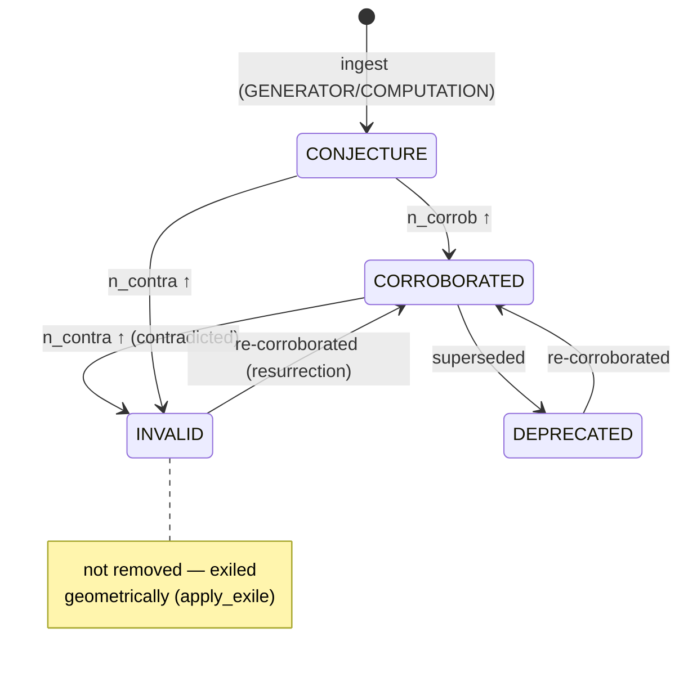

# `metacog/` — the MetaCog-Mem core

This package is the memory manifold and everything that operates on it. It
has no required hyperparameters: every threshold is a mathematical constant
or emerges from the data. The top-level [`README`](../README.md) gives the
paper-level overview; this document is the **module map and the invariants
each module must preserve**.

## The one schema

Everything is a `Point` (`epistemic.py`). A point of any kind — `FACT`,
`THOUGHT`, `ACTION`, or a self-built tool — carries:

- `embedding_orig` — the raw sentence embedding;
- `keywords` + `keywords_embedding` — the **position-weighted** keyword
  projection (salience-ordered, `1/(i+1)` decay), the handle the walk
  retrieves on;
- a Beta posterior over `n_corrob` / `n_contra` counters → its epistemic
  **σ** (`uncertainty.py`);
- `state` ∈ {`CONJECTURE`, `CORROBORATED`, `INVALID`, `DEPRECATED`, …};
- an open `tags` list (`tool`, `tool_workflow`, `entity`, `atomic`,
  `lateral_absorbed`, `generated`, …) that refines role over time;
- lineage (`parents`, `sequence_prev/next`) and the pulled offsets
  (`delta_active`, `delta_latent`) that *are* the edge-free relations.

A point's epistemic state machine — note **zero deletion**: invalid points
are exiled geometrically and *resurrect* on fresh corroboration.



## Two invariants, enforced

1. **Anti-laundering (Corollary 5).** `Observation`s carry a `SourceClass`;
   `Observation(source=GENERATOR)` raises `LaunderingError`. LLM output may
   become a `THOUGHT`/`ACTION` (content ∈ P) but never an observation (∈ O)
   that updates counters. `audit.py` verifies this across a whole store.
2. **Zero deletion.** Nothing is removed. `INVALID`/`DEPRECATED` exile a
   point geometrically; re-corroboration resurrects it.

## Module map

### Substrate
| module | responsibility | key invariant |
|---|---|---|
| `epistemic.py` | `Point`, `Observation`, `A(·)`, state machine, `PointKind`, tags | `GENERATOR`→`Observation` is impossible |
| `geometry.py` | manifold ops — `apply_pull`, `apply_exile`, effective embedding, `retrieve_hybrid`, lineage spread | relations are pulls, not edges |
| `uncertainty.py` | β-uncertainty ⊕ keyword-order σ; GUM `propagate`; emergent `prune_threshold` | thresholds emerge (`median ± σ`) |
| `keywords.py` | LLM / frequency keyword extraction; position-weighted embedding | **retry + never cache empty** (silent-failure discipline) |
| `bm25.py`, `fuzzy.py` | content-first BM25 and fuzzy Levenshtein retrieval signals | BM25 indexes raw content, not keyword summaries |

### Retrieval & reasoning
| module | responsibility |
|---|---|
| `meta_walk.py` | the coordinated FACT/THOUGHT/ACTION walk: HyDE channel, Chain-of-Note MAP-REDUCE, thought chain, **uncertainty-governed depth** (floor / σ-cap / coverage-stop), evidence cap |
| `reasoning.py` | `reason()` orchestrator over the walk |
| `compression.py` | retrospective trajectory Chasles compression |
| `anchors.py` | kind-agnostic semantic perception layer for the walk |

### Self-organization (one Poisson floor, `λ + √λ`)
| module | responsibility |
|---|---|
| `collision.py` | proximity collision, N-way fission, identity merge, Chasles anchors |
| `lateral.py` | co-retrieval (functional) collision → keepers + on-target child expansion |
| `spike.py` | spike-and-path: reasoning- and workflow-Chasles compression |
| `skills.py` | memory skills: tool crystallization, tool-intent metacognition, `match_tool` fast-path |
| `communities.py` | Level-1 community / observator detection |

### Perception, perspective, execution
| module | responsibility |
|---|---|
| `detectors.py` | deterministic conversation signals (no LLM) |
| `entities.py`, `atomic.py` | edge-free entity beacons & mem0-style atomic-fact handles |
| `observator.py` | observators: per-source parallel views, polarization, delegation |
| `execution.py`, `executor.py` | ACTION execution + result-FACT lineage |

### Edges of the package
| module | responsibility |
|---|---|
| `memory.py` | the top-level `Memory` wrapper (ingest, observe, walk, sleep, save/load) |
| `llm.py` | `ClaudeLLM` — the only LLM adapter; **retries transient 5xx/overloaded**, outputs always typed `GENERATOR` |
| `defaults.py` | `SimpleEncoder`, `NoOpExecutor`, default extractors |
| `audit.py` | non-laundering verification |
| `mcp_server.py` | the MCP service (below) |

## The walk in one paragraph (`meta_walk.py`)

`MetaWalker.step()` retrieves (hybrid + HyDE), labels relevance
(Chain-of-Note), folds on-target facts into the persistent
`_relevant_cum`, and generates a `THOUGHT` whose keywords come **only**
from walked points. After a floor of `_MIN_STAGES = 3`, the walk stops when
the propagated `σ_path` over the fact★ coherence-hops exceeds the emergent
cutoff **or** when the gathered keywords cover the query. `walk_start`
(in `mcp_server.py`) loops `step()` to completion and returns the bounded
composable evidence (`_MAX_EVIDENCE = 15`) plus at most
`_MAX_RETURNED_FACTS = 20` retrieved turns and the reasoning chain — full
recall stays in `fact_ids_cumulative`.

## Named skills — theoretical tool directories (`memory.py` + `meta_walk.py`)

A **skill** is a named directory tree of tools, built and grown inside the
manifold (no separate store):

- `Memory.build_skill(query, user_id, session_id)` — **task-mode** walk:
  gold is a tool fact as readily as a semantic fact; the depth gate is
  `enough_tools_for_workflow` (LLM, per depth, fail-closed) instead of the
  QA σ-stop. Emits a NAMED skill folder (nested JSON), ingests it, and
  logs the resolution.
- `Memory.ingest_skill(tree, *, name, user_id, session_id, date)` —
  re-indexes the JSON tree as `FACT`s tagged
  `skill·tool·name:<name>·user:<id>·session:<id>·date:<…>`; topology via
  lineage **and** `ref:skill:<name>:path:/:parent:` tokens.
- **Double query** — `nearest_facts_with_fallback(..., section_filter=…)`
  RRF-merges a section-restricted retrieval (the `session:`/`user:`/`name:`
  tags) with the free query; `walk_start(user_id, session_id, …)` wires it.
- **Latent distiller** — `record_resolution()` logs (query, walk-path ids,
  output); `distill_skills()` (run in `sleep()` when `skills_enabled`)
  crystallizes a tool `ACTION` whose `parents` are the explicating
  facts/thoughts/actions, so the next recurrence is retrieved without
  forced metacognition. Idempotent via `_distill_cursor`.

## MCP tools (`mcp_server.py`)

Classified into role tiers (`canonical_tools.py`). The `external` surface
exposes **T1 + T2**; **T3** stays callable internally (surface `all`) but off the
agent-facing surface — the walk / sleep orchestrate it.

```
#####  T1 — CANONICAL primitives (exposed)  #####
# feed
ingest              add a FACT / THOUGHT / ACTION
ingest_message      EPISODIC: index a message (user/agent), async, timestamped
push_code           evaluate & route generated code → project doc and/or tool
# ask
retrieve            top-k hybrid retrieval (RRF); returns a retrieval_id.
                    abstain=true → [] when no chunk is sufficiently activated
walk_start          run a COMPLETE uncertainty-governed walk (depth = σ);
                    user_id/session_id add the double-query section boost
assemble_set        orchestrated exhaustive-set retrieval ("list every …")
relate              co-retrieved neighbours of node ids (associative spreading)
# observe state
stats · inspect · list_tags
# feedback & correction
mark_useful         rate a retrieval 0/1/2 → calibrates decay + wiki credibility
forget              soft-invalidate ONE node (reason req.; optional superseded_by)

#####  T2 — agent-tool machinery (exposed)  #####
ensure_tool         get a tool, generating it if absent ("no tool → make it")
match_tool          fast-path: does a generated tool already cover this query?
build_skill         task-mode walk → synthesise + ingest a named skill
list_tools_learned  list the self-built tool set
report_tool         reinforce a tool (ok) / auto-retire after repeated failures
retire_tool         soft-deprecate (stop reuse) or hard-remove a tool
update_tool         rewrite a tool's body (re-embedded); revives a deprecated one

#####  T3 — internal (callable in `all`, NOT on the external surface)  #####
# retrieval modes the walk orchestrates
presearch           BATCH reconnaissance GATE: top-k per query, NO walk
scoped_answer       tag-filtered cascade (match=exact|fuzzy|regex)
scoped_list         non-kNN filtered listing (scan by event/date/tags/kind)
search_nodes        tri-modal relevance over a filtered pool (no replacement)
clue_search · event_search · reason · walk_keepup
# bag mechanism (assemble_set / event scans drive it)
collect · bag · bags · bag_render
# observators
declare_observator · detect_polarized · spawn_observators · route · list_communities
# autonomic (run by the system, not the caller)
sleep               consolidation: collision + decay-fit + forget-merge + wiki reconcile
save · audit · crystallize_skills
# internal / admin
observe · process_turn · capture_code_tool · ingest_skill · get_session_skill
# deprecated (removal follow-up)
walk_next           walk_start now runs to completion
```

## Touching this package

- A new retrieval signal goes through `retrieve_hybrid` (RRF), never a new
  bespoke ranker.
- Any LLM call must **retry on transient errors and never cache an empty
  result** — the single largest regression this codebase suffered was a
  cached `[]` from one 529.
- A new "threshold" must emerge from the population or be a math constant —
  if you find yourself adding a tunable number, derive it instead.
- Generated text is `source=GENERATOR`. If you wrap it in an `Observation`,
  the audit will (correctly) fail.
