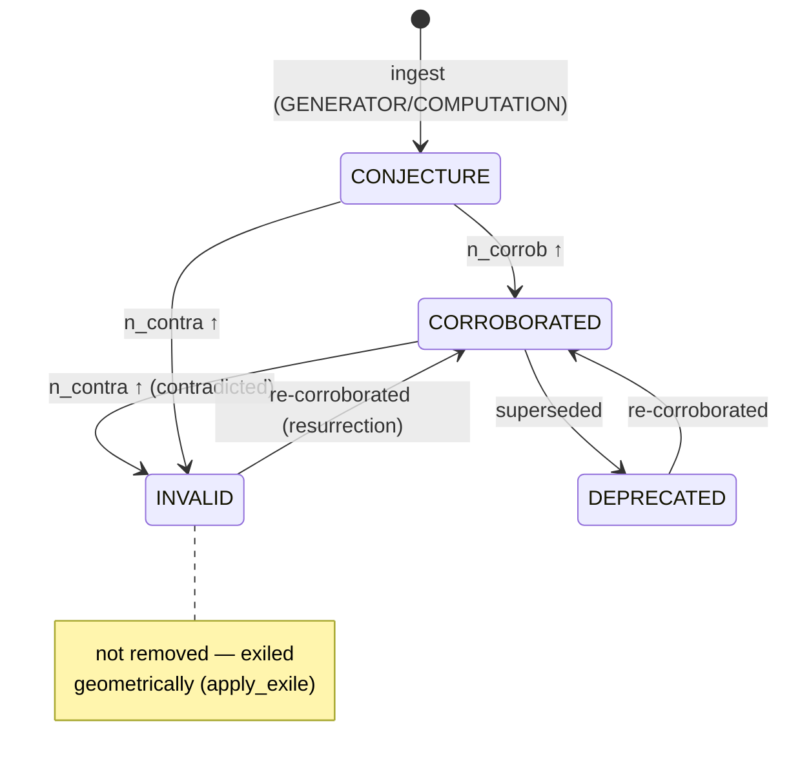

# `metacog/` — the MetaCog-Mem core

This package is the memory manifold and everything that operates on it. It
has no required hyperparameters: every threshold is a mathematical constant
or emerges from the data. The top-level [`README`](../README.md) gives the
paper-level overview; this document is the **module map and the invariants
each module must preserve**.

## The one schema

Everything is a `Point` (`epistemic.py`). A point of any kind — `FACT`,
`THOUGHT`, `ACTION`, or a self-built tool — carries:

- `embedding_orig` — the raw sentence embedding;
- `keywords` + `keywords_embedding` — the **position-weighted** keyword
  projection (salience-ordered, `1/(i+1)` decay), the handle the walk
  retrieves on;
- a Beta posterior over `n_corrob` / `n_contra` counters → its epistemic
  **σ** (`uncertainty.py`);
- `state` ∈ {`CONJECTURE`, `CORROBORATED`, `INVALID`, `DEPRECATED`, …};
- an open `tags` list (`tool`, `tool_workflow`, `entity`, `atomic`,
  `lateral_absorbed`, `generated`, …) that refines role over time;
- lineage (`parents`, `sequence_prev/next`) and the pulled offsets
  (`delta_active`, `delta_latent`) that *are* the edge-free relations.

A point's epistemic state machine — note **zero deletion**: invalid points
are exiled geometrically and *resurrect* on fresh corroboration.



## Two invariants, enforced

1. **Anti-laundering (Corollary 5).** `Observation`s carry a `SourceClass`;
   `Observation(source=GENERATOR)` raises `LaunderingError`. LLM output may
   become a `THOUGHT`/`ACTION` (content ∈ P) but never an observation (∈ O)
   that updates counters. `audit.py` verifies this across a whole store.
2. **Zero deletion.** Nothing is removed. `INVALID`/`DEPRECATED` exile a
   point geometrically; re-corroboration resurrects it.

## Module map

### Substrate
| module | responsibility | key invariant |
|---|---|---|
| `epistemic.py` | `Point`, `Observation`, `A(·)`, state machine, `PointKind`, tags | `GENERATOR`→`Observation` is impossible |
| `geometry.py` | manifold ops — `apply_pull`, `apply_exile`, effective embedding, `retrieve_hybrid`, lineage spread | relations are pulls, not edges |
| `uncertainty.py` | β-uncertainty ⊕ keyword-order σ; GUM `propagate`; emergent `prune_threshold` | thresholds emerge (`median ± σ`) |
| `keywords.py` | LLM / frequency keyword extraction; position-weighted embedding | **retry + never cache empty** (silent-failure discipline) |
| `bm25.py`, `fuzzy.py` | content-first BM25 and fuzzy Levenshtein retrieval signals | BM25 indexes raw content, not keyword summaries |

### Retrieval & reasoning
| module | responsibility |
|---|---|
| `meta_walk.py` | the coordinated FACT/THOUGHT/ACTION walk: HyDE channel, Chain-of-Note MAP-REDUCE, thought chain, **uncertainty-governed depth** (floor / σ-cap / coverage-stop), evidence cap |
| `reasoning.py` | `reason()` orchestrator over the walk |
| `compression.py` | retrospective trajectory Chasles compression |
| `anchors.py` | kind-agnostic semantic perception layer for the walk |

### Self-organization (one Poisson floor, `λ + √λ`)
| module | responsibility |
|---|---|
| `collision.py` | proximity collision, N-way fission, identity merge, Chasles anchors |
| `lateral.py` | co-retrieval (functional) collision → keepers + on-target child expansion |
| `spike.py` | spike-and-path: reasoning- and workflow-Chasles compression |
| `skills.py` | memory skills: tool crystallization, tool-intent metacognition, `match_tool` fast-path |
| `communities.py` | Level-1 community / observator detection |

### The mnema usage-journal layer (opt-in, SQL, failure-safe)
| module | responsibility |
|---|---|
| `journal.py` | append-only SQLite access-log, SEPARATE from the store. SQL-derivable triggers: co-retrieval self-join, `path_traversals` (Chasles), `tags` (hierarchical), `collision_events`, `forget_events`, `wiki_docs`/`wiki_refs`/`okf_fields`; the safety rails: `merge_ledger` (persistent, reversible redirects), `wiki_ref_remaps`, `tool_events`, `okf_derived`, `okf_vocab`. Opt-in (`journal_path="auto"`); every consumer no-ops without it |
| `need_odds.py` | Anderson–Schooler base-level activation `Σ(now−t)^−d`, `fit_exponent` (grid-fit by useful/useless AUC), `blend` (min-max mix, not a sigmoid squash) |
| `wiki.py` | OKF wiki helpers — render/parse (YAML frontmatter + body), `[[node_id]]` wikilinks, `#tag`, `context_tags` |
| `canonical_tools.py` | the T1/T2/T3 tool-tier manifest + surfaces (`external`/`external_light`/`canonical`/`all`); test-guarded to partition the live `@app.tool()` set exactly |

### Perception, perspective, execution
| module | responsibility |
|---|---|
| `detectors.py` | deterministic conversation signals (no LLM) |
| `entities.py`, `atomic.py` | edge-free entity beacons & mem0-style atomic-fact handles |
| `observator.py` | observators: per-source parallel views, polarization, delegation |
| `execution.py`, `executor.py` | ACTION execution + result-FACT lineage |

### Edges of the package
| module | responsibility |
|---|---|
| `memory.py` | the top-level `Memory` wrapper (ingest, observe, walk, sleep, save/load) |
| `llm.py` | `ClaudeLLM` — the only LLM adapter; **retries transient 5xx/overloaded**, outputs always typed `GENERATOR` |
| `defaults.py` | `SimpleEncoder`, `NoOpExecutor`, default extractors |
| `audit.py` | non-laundering verification |
| `mcp_server.py` | the MCP service (below) |

## The walk in one paragraph (`meta_walk.py`)

`MetaWalker.step()` retrieves (hybrid + HyDE), labels relevance
(Chain-of-Note), folds on-target facts into the persistent
`_relevant_cum`, and generates a `THOUGHT` whose keywords come **only**
from walked points. After a floor of `_MIN_STAGES = 3`, the walk stops when
the propagated `σ_path` over the fact★ coherence-hops exceeds the emergent
cutoff **or** when the gathered keywords cover the query. `walk_start`
(in `mcp_server.py`) loops `step()` to completion and returns the bounded
composable evidence (`_MAX_EVIDENCE = 15`) plus at most
`_MAX_RETURNED_FACTS = 20` retrieved turns and the reasoning chain — full
recall stays in `fact_ids_cumulative`.

## Named skills — theoretical tool directories (`memory.py` + `meta_walk.py`)

A **skill** is a named directory tree of tools, built and grown inside the
manifold (no separate store):

- `Memory.build_skill(query, user_id, session_id)` — **task-mode** walk:
  gold is a tool fact as readily as a semantic fact; the depth gate is
  `enough_tools_for_workflow` (LLM, per depth, fail-closed) instead of the
  QA σ-stop. Emits a NAMED skill folder (nested JSON), ingests it, and
  logs the resolution.
- `Memory.ingest_skill(tree, *, name, user_id, session_id, date)` —
  re-indexes the JSON tree as `FACT`s tagged
  `skill·tool·name:<name>·user:<id>·session:<id>·date:<…>`; topology via
  lineage **and** `ref:skill:<name>:path:/:parent:` tokens.
- **Double query** — `nearest_facts_with_fallback(..., section_filter=…)`
  RRF-merges a section-restricted retrieval (the `session:`/`user:`/`name:`
  tags) with the free query; `walk_start(user_id, session_id, …)` wires it.
- **Latent distiller** — `record_resolution()` logs (query, walk-path ids,
  output); `distill_skills()` (run in `sleep()` when `skills_enabled`)
  crystallizes a tool `ACTION` whose `parents` are the explicating
  facts/thoughts/actions, so the next recurrence is retrieved without
  forced metacognition. Idempotent via `_distill_cursor`.

## The mnema layer — usage journal, ACT-R activation, feedback, forgetting

Alongside the point cloud (the **store**) sits an optional append-only SQLite
**usage journal** (`journal.py`), mirroring mnema's split of the store from its
access-log. Opt-in (`Memory(journal_path="auto")` → `<storage>.journal.db`; the
MCP server attaches one by default) and **failure-safe** — every mechanism below
falls back to an in-memory path or a no-op without it, so behaviour is unchanged
when absent. Structural signals become plain SQL instead of bespoke ledgers:
co-retrieval (self-join on `access_events`), the Chasles trigger
(`path_traversals`, `GROUP BY signature HAVING COUNT(*)≥k` with an append-only
refractory derived from `collision_events`), and the hierarchical tag index.

**ACT-R activation in ranking.** `retrieve` optionally blends the base relevance
with the two halves of ACT-R activation `A = B (base-level) + Σ spreading`, both
computed from the journal and both **OFF by default** (mnema's defaults):
`recency_weight` mixes in **need-odds** (recency×frequency of accesses under a
learned exponent `d`); `spreading_weight` mixes in **associative spreading**
(nodes co-retrieved with the top hits — also exposed directly as `relate`).

**Feedback loop (L3).** `retrieve` returns a `retrieval_id`; the walk auto-labels
its own retrievals by what it used, and `mark_useful(rid, 0/1/2)` lets the agent
rate one. Those labels let `fit_decay` (run every `sleep`) fit the exponent `d`
need-odds uses — the memory calibrates its own recency curve from real use.

**Forgetting — two phases.** Query time only **decays** (the ranking above); the
pruning is **offline** so it never adds latency. In `sleep` (`forget_enabled`) a
conservative emergent pass drops accessed-then-cold nodes (below `mean−σ`; tools
& the untried kept). Independently, `forget(node_id, reason[, superseded_by])` is
the explicit runtime correction: append-only soft-invalidation (state `INVALID`
→ leaves retrieval/walk) written as a **DB event** (`forget_events`); the next
`sleep` runs the **latent merge** (`merge_forgotten`), redirecting a superseded
node's alias to its successor. This is mnema's `forget` (tool) + `reflect`
(offline merge) split.

**Abstention.** `retrieve(abstain=True)` applies the ACT-R retrieval threshold:
returns `[]` ("I don't know") when no chunk is sufficiently activated — emergent
floor (best must clear `mean+2σ` of the background) or a fixed τ.

**Tool lifecycle.** Beyond create/find/reuse (`ensure_tool`/`match_tool`/
`build_skill`), tools have the retract & correct half: `report_tool(ok)`
reinforces / auto-retires after repeated failures; `retire_tool` soft-deprecates
(so `match_tool` skips it) or hard-removes; `update_tool` rewrites & revives.

**Tool tiers & surface.** `canonical_tools.py` classifies tools into **T1**
(canonical primitives), **T2** (agent-tool machinery), **T3** (internal
mechanisms / walk modes / autonomic passes). `build_app(surface=…)` /
`METACOG_SURFACE` gates what the MCP exposes (`external` = T1+T2); unexposed
tools stay callable internally.

## The OKF wiki — a bidirectional, continuously-evolving RAG extension

An optional wiki layer (`wiki.py` + `memory.py` + `journal.py`) in Google's
**Open Knowledge Format** (concept-per-file markdown, YAML frontmatter) that
**co-evolves** with the RAG rather than sitting in a separate silo.

- **Links live in three places** — the OKF **frontmatter** (`refs:`, many per
  doc), **inline** in the body as `[[node_id]]` wikilinks, and the DB link table
  (`wiki_refs`); tags likewise in frontmatter + inline `#tag`. `feed_wiki`
  builds/updates a doc from RAG nodes; `docs_for_node` is the reverse edge.
- **Both directions evolve** — *RAG→wiki*: `reconcile_wiki` (offline in `sleep`)
  follows `resolve_alias`, so a **forgotten→merged** node has its refs rewritten
  `[[old]]→[[new]]` everywhere and an `INVALID` node flags its refs **stale**.
  *wiki→RAG*: `ingest_from_wiki` ingests new wiki prose as a node **carrying the
  doc's tags as context**, linked back.
- **OKF made functional, no migrations** — frontmatter alone is inert; an **EAV
  index** (`okf_fields`) makes every field queryable (`wiki_where("tags", …)`,
  `wiki_where("refs", node_id)`), **recovers the schema from the data**
  (`okf_schema()`, no registry), and needs no migrations (a new field is just new
  rows). `import_okf` consumes an external bundle.
- **Feedback is first-order** — `mark_useful` flows into the wiki as a
  credibility signal: each doc's `useful`/`useless` counts are re-indexed (EAV)
  and rendered in the OKF frontmatter, so docs are queryable/rankable by real
  feedback.
- **Docs follow their sources (drift)** — each link stores the node's
  fingerprint (`wiki.node_fingerprint`: content hash : knowledge-tags hash);
  the drift pass of `reconcile_wiki` (in `sleep`, or targeted by
  `refresh_wiki_for_node`, which `update_tool` calls) compares it with the node
  now (`fingerprint_drift` → `content_changed` / `tags_changed`). A
  **generated** doc (`body_mode`, `feed_wiki` without prose, tool docs)
  regenerates from its refs; an **authored** doc is never overwritten — refs
  flagged `outdated` (EAV field, `check_wiki` → `outdated_ref`), and
  `refresh_wiki(doc[, body])` returns the pending changes or stores the new
  prose. Tests: `tests/test_wiki_drift.py`.
- **Objects** (`wiki.py` parsers + `memory.py`, journal tables `wiki_seeds` /
  `wiki_annotations` / `wiki_ops` / `wiki_pending`) — `<portion id seeds refs
  mode>` blocks own their sources (explicit `refs`, `<var/>` bindings, cached
  **seed query** results) and a generated one re-renders alone
  (`_regenerate_portion`); `rerun_seeds` (in `sleep`) re-runs each query,
  diffs vs the cache, absorbs (generated) or records a `wiki_pending` row
  with the diff (authored / kept). `<var name node field/>` is a live binding
  (`resolve_body` for the rendered view; `set_var` refuses a missing node).
  Every var / portion edit is a reversible `wiki_ops` row (`revert_wiki_op`).
  `annotate(doc, target, note, kind)` — `keep` protects a target from
  regeneration and removal (`_kept`); annotations render in the frontmatter
  and as footnotes. `wiki_doc(view="source"|"rendered")`. Tests:
  `tests/test_wiki_objects.py`.

## Safety rails on identity ops — redirects, reversibility, reasons, proposals

Five rails (borrowed from knowledge-graph engineering practice) make the
destructive half of the memory — forget, merge, collapse — safe and legible.
All live in the journal; all no-op without one.

- **Active redirects, not one-shot rewrites.** Every forget→merge, lateral
  collapse and duplicate merge writes a `merge_ledger` row (`absorbed →
  keeper`, kind, **reason**, snapshot). `resolve_alias` follows it and is
  **re-hydrated from the ledger after a restart**, so a reference discovered
  *after* the merge (a late `feed_wiki`, an external `import_okf`, a new
  process) still lands on the keeper; chains `A→B→C` resolve to the final
  survivor and `absorbed_into(C)` gives the transitive reverse edge.
- **Reversible ledger.** `revert_merge(id)` undoes every live row for an id:
  drops the redirect, restores the node's pre-op state/tags from the oldest
  snapshot, and un-rewrites **exactly** the wiki refs the redirect rewrote
  (`wiki_ref_remaps` traces which `[[…]]` occurrences came from the old id and
  whether the doc already cited the keeper) — the author's own links stay.
- **Explicit reason codes, never a silent collapse.** A stale wiki ref carries
  *why* (`missing_node` / `invalidated` / `deprecated`); `feed_wiki` /
  `import_okf` return `issues` (`redirected`, `missing_node` — the ref is kept
  and flagged, not dropped — `no_frontmatter`, `type_proposed`); every tool
  lifecycle step is a `tool_events` row (`created` / `reused` / `ok` / `failed`
  / `retired` / `promoted` / `rejected: synthesis_failed` …), readable via
  `tool_history`.
- **Consistency check ≠ inference.** `check_wiki` is **read-only**: it
  surfaces violations (`stale_ref` + reason, `body_ref_unlinked`,
  `link_not_in_body`, `tag_not_in_frontmatter`, `empty_body`, `schema_drift`
  within a type, unvetted types) and writes nothing. `infer_wiki` is
  **materialized inference, OFF by default** (`infer_enabled`): derived fields
  (`related` via shared refs, `tags` drift of cited nodes, `absorbed` ids) go
  to their **own table** (`okf_derived`), never into the asserted index, and
  **asserted facts win** (an asserted `(key, value)` is never re-derived).
  `wiki_where(…, derived=True)` opts in at query time.
- **Proposal loop for out-of-vocabulary terms.** An OKF `type` outside the
  vetted vocabulary (`note` / `topic` / `tool` + accepted ones) is **preserved
  as a proposal** (`okf_vocab`): the doc is written and queryable, the term is
  neither rejected nor silently canonical until `vet_okf_type(t, accept)`.
  Likewise every emergent tool starts **`proposed`** — fully usable — and earns
  **`established`** by use (`promote_tools` in `sleep` after
  `tool_promote_after` successes with no failure streak, or `promote_tool`);
  its wiki doc exposes `status`, so `wiki_where("status", "proposed")` lists
  the unvetted capability set.

## Claude Code plugin (`../.claude-plugin/`, `../hooks/`, `../bin/`)

The repo root is a Claude Code plugin: `plugin.json` declares the MCP server
(`bin/metacog-mcp.sh` → `python -m metacog.mcp_server --storage <brain>`,
surface `external`) and `hooks/hooks.json` wires four hooks — **SessionStart**
(`session_start.py`: inject the memory discipline), **PostToolUse** on
`retrieve`/`walk_start` (`recall_gap.py`: grep the in-band **gap sentinel**
`mcp_server.GAP_SENTINEL`, emitted when `Memory.abstains(query)`, and inject a
"ground first, then ingest" directive), **SessionEnd** (`capture_session.py`:
feed the user's typed messages as episodic turns, dedup, `sleep`, `save`) and
**UserPromptSubmit** (`auto_recall.py`, opt-in `METACOG_AUTO_RECALL=1`).
Brain resolution is shared (`hooks/_common.resolve_storage`): `.metacog-brain`
marker walked up from cwd > `METACOG_STORAGE` > `~/.metacog/memory.pkl`. Hooks
are stdlib-only at the edge, import `metacog` from the plugin root, and are
silent + exit 0 on any error. Tests: `tests/test_plugin_hooks.py`.

**Encoder.** Server and hooks resolve ONE encoder via `defaults.make_encoder()`
(`METACOG_ENCODER`: `auto` → `FastEmbedEncoder`, mnema's multilingual
paraphrase-MiniLM (384d, ONNX/CPU), else a warned `SimpleEncoder` fallback).
`Memory.save` stamps `encoder_id`; `load` re-encodes all points (`reencode`)
when the stamp differs — a brain is never read in the wrong embedding space.
`SimpleEncoder` stays the hermetic test default. Tests: `tests/test_encoder.py`.

**Reranker.** `defaults.make_reranker()` (`METACOG_RERANKER`: `auto` →
`CrossEncoderReranker`, mnema's jina multilingual cross-encoder, else a warned
`None`) is wired by the server only. `Memory.retrieve(rerank=None|True|False,
rerank_pre=30)` runs mnema's pipeline — cosine pre-fetch → joint scoring →
sigmoid → top-k — *before* the need-odds / spreading blends, and exposes the
logit as `rerank_score`; failure-safe (cosine order kept). The oblique judge
(`_proposition_scores`) uses the same object. Tests: `tests/test_reranker.py`.

## MCP tools (`mcp_server.py`)

Classified into role tiers (`canonical_tools.py`). The `external` surface
exposes **T1 + T2**; **T3** stays callable internally (surface `all`) but off the
agent-facing surface — the walk / sleep orchestrate it.

```
#####  T1 — CANONICAL primitives (exposed)  #####
# feed
ingest              add a FACT / THOUGHT / ACTION (+ optional indexing `tags`)
ingest_message      EPISODIC: index a message (user/agent), async, timestamped
push_code           evaluate & route generated code → project doc and/or tool
# ask
retrieve            top-k hybrid retrieval (RRF); returns a retrieval_id.
                    abstain=true → [] when no chunk is sufficiently activated;
                    a gap always appends the in-band sentinel (plugin hook)
walk_start          run a COMPLETE uncertainty-governed walk (depth = σ);
                    user_id/session_id add the double-query section boost
assemble_set        orchestrated exhaustive-set retrieval ("list every …")
relate              co-retrieved neighbours of node ids (associative spreading)
# observe state
stats · inspect · list_tags
# feedback & correction
mark_useful         rate a retrieval 0/1/2 → calibrates decay + wiki credibility
forget              soft-invalidate ONE node (reason req.; optional superseded_by)
revert_merge        undo a forget/merge/collapse from the ledger (state, redirect,
                    and exactly the wiki refs it rewrote)
# OKF wiki (author / query the RAG-extension knowledge layer)
feed_wiki           RAG→wiki: build/update an OKF doc from node ids (refs in
                    frontmatter + inline [[id]]); returns `issues` with reasons
wiki_doc            render a doc's current OKF markdown (live refs, feedback, status)
ingest_from_wiki    wiki→RAG: ingest new prose as a node carrying the doc's tags
wiki_where          query the EAV field index by any frontmatter field
okf_schema          the schema recovered from the data ({type: [keys]})
import_okf          consume an external OKF doc (redirects followed, issues reported)
docs_for_node       reverse link: which docs cite this node
check_wiki          READ-ONLY consistency check (stale refs + reason, prose/link
                    mismatches, outdated refs, schema drift, unvetted types)
refresh_wiki        re-align a doc with its changed refs (generated: re-render;
                    authored: pending changes, or store the rewritten body)
wiki_seed · wiki_var · wiki_portion · wiki_annotate · wiki_pending · wiki_ops
                    the wiki OBJECTS: seed queries (cached, diffed offline),
                    live variable bindings, portion blocks, typed annotations
                    (keep protects), pending changes, reversible op history
okf_proposals       out-of-vocabulary OKF types preserved as proposals
vet_okf_type        accept / reject a proposed type (closes the vocabulary loop)

#####  T2 — agent-tool machinery (exposed)  #####
ensure_tool         get a tool, generating it if absent ("no tool → make it");
                    a new tool starts `proposed`; failures return a `reason`
match_tool          fast-path: does a generated tool already cover this query?
build_skill         task-mode walk → synthesise + ingest a named skill
list_tools_learned  list the self-built tool set
report_tool         reinforce a tool (ok) / auto-retire after repeated failures
retire_tool         soft-deprecate (stop reuse) or hard-remove a tool (+ reason)
update_tool         rewrite a tool's body (re-embedded); revives a deprecated one
promote_tool        vet a proposed tool as established (also autonomic in sleep)

#####  T3 — internal (callable in `all`, NOT on the external surface)  #####
# retrieval modes the walk orchestrates
presearch           BATCH reconnaissance GATE: top-k per query, NO walk
scoped_answer       tag-filtered cascade (match=exact|fuzzy|regex)
scoped_list         non-kNN filtered listing (scan by event/date/tags/kind)
search_nodes        tri-modal relevance over a filtered pool (no replacement)
clue_search · event_search · reason · walk_keepup
# bag mechanism (assemble_set / event scans drive it)
collect · bag · bags · bag_render
# observators
declare_observator · detect_polarized · spawn_observators · route · list_communities
# autonomic (run by the system, not the caller)
sleep               consolidation: collision + decay-fit + forget-merge + wiki
                    reconcile + tool promotion (+ wiki inference if enabled)
infer_wiki          materialized wiki inference → separate derived table (opt-in)
save · audit · crystallize_skills
# internal / admin
observe · process_turn · capture_code_tool · ingest_skill · get_session_skill
# deprecated (removal follow-up)
walk_next           walk_start now runs to completion
```

## Touching this package

- A new retrieval signal goes through `retrieve_hybrid` (RRF), never a new
  bespoke ranker.
- Any LLM call must **retry on transient errors and never cache an empty
  result** — the single largest regression this codebase suffered was a
  cached `[]` from one 529.
- A new "threshold" must emerge from the population or be a math constant —
  if you find yourself adding a tunable number, derive it instead.
- Generated text is `source=GENERATOR`. If you wrap it in an `Observation`,
  the audit will (correctly) fail.
